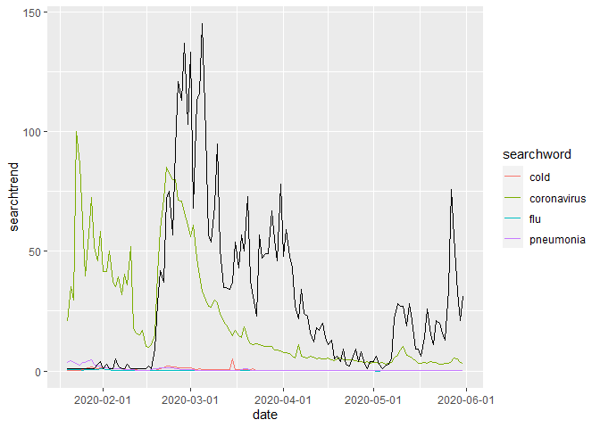

코로나 확진자 증가와 코로나 검색 트랜드 사이의 관계성 분석
================
주윤하
August 7, 2020

# 코로나 확진자 증가에 따른 검색 트랜드 관계성 분석

코로나 바이러스 전파로 인해 전 세계적으로 일상생활에 큰 변화가 있습니다. 마스크 착용, 거리두기, 밀폐된 공간 방문 자제 등등
정부에서 제시한 정책들이 다양합니다. 코로나 분석 첫 번째는 확진자 증가에 따른 검색 트랜드 관계성 분석입니다.

## 데이터 분석 절차

  - 사용할 데이터를 로드하여 형태를 확인
  - 전처리가 필요한 데이터는 작업
  - 데이터 사이의 관계를 분석하여 분석표 작성
  - 그래프로 분석표를 시각화
  - 관계성 분석을 통해 결론 도출

## Q1. 확진자 증가와 검색 트랜드 사이의 관계 분석.

확진자가 증가됨에 따라서 사람들의 검색 트랜드가 어떤식으로 변화되었는지, 두 변수 사이에는 유의미한 관계가 있는지 분석해보도록
하겠습니다.

### 1\. 전처리가 필요한 데이터는 작업

  - 환자의 정보 데이터에서 사용할 데이터만 추출 후 확진 일자로 묶어 카운트합니다.
  - 검색 트랜드 데이터에서는 사용하기 용이하도록 프레임의 형태를 변경합니다.
  - 확진자 수인 num 변수 중 NA값은 1로 대체하였습니다.

<!-- end list -->

``` r
patient_inc <- patient_info %>% 
  select(infection_order, contact_number, confirmed_date) %>% 
  group_by(confirmed_date) %>% 
  summarise(n=n())
```

    ## `summarise()` ungrouping output (override with `.groups` argument)

``` r
patient_inc <- rename(patient_inc, num=n)
patient_inc <- rename(patient_inc, date=confirmed_date)

search_dd <- gather(search_trend, searchword, searchtrend, cold:coronavirus) %>% filter(date >= "2020-01-01")


search_patient <- search_dd %>% 
  filter(search_dd >= "2020-01-20" & search_dd < "2020-06-02") %>% 
  left_join(patient_inc, by="date")

search_patient$num <- ifelse(is.na(search_patient$num), 1, search_patient$num)
```

### 2\. (1)에서 정리한 분석표를 바탕으로 그래프 그리기

해당 분석표의 기준은 시간의 흐름이므로 연속변수를 표현하는 geom\_line을 사용하여 시각화 하였습니다. 검색어별 시간별
추이와 확진자 추이(검정) 사이의 관계를 나타내고 있습니다.

``` r
ggplot(search_patient)+
  geom_line(aes(date, searchtrend, group=searchword, color=searchword),
  interactive=T) + scale_x_date(breaks="month")+
  geom_line(aes(x=date, y=num))
```

    ## Warning: Ignoring unknown parameters: interactive

<!-- -->

해당 그래프를 보면 코로나바이러스에 대한 검색은 2월 초, 3월 초에 가장 높았습니다. 코로나 바이러스 확진자의 경우 2월
중순부터 3월 중순까지 가장 높게 나타났습니다.

### 3\. 관계성 분석

``` r
ttest <- search_patient %>% 
  filter(searchword =="coronavirus")

cor.test(ttest$searchtrend, ttest$num)
```

    ## 
    ##  Pearson's product-moment correlation
    ## 
    ## data:  ttest$searchtrend and ttest$num
    ## t = 3.8269, df = 131, p-value = 0.0002001
    ## alternative hypothesis: true correlation is not equal to 0
    ## 95 percent confidence interval:
    ##  0.1552526 0.4623678
    ## sample estimates:
    ##      cor 
    ## 0.317099

p-value는 0.05이하로 통계적으로 유의하다는 것을 알 수 있지만, cor 값이 0.317로 두 변수 사이의 상관관계가
작다는 것을 알 수 있습니다.

따라서, 코로나 바이러스 확진자의 증가 추이와 ’코로나’검색 사이에는 큰 관계성이 없음을 알 수 있습니다.
