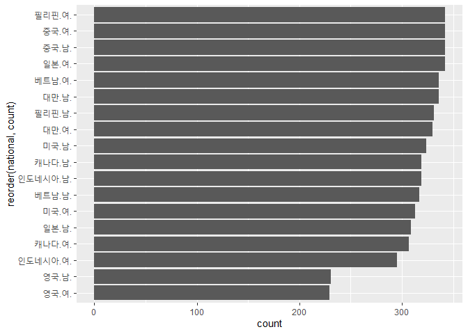
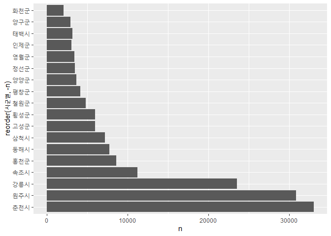
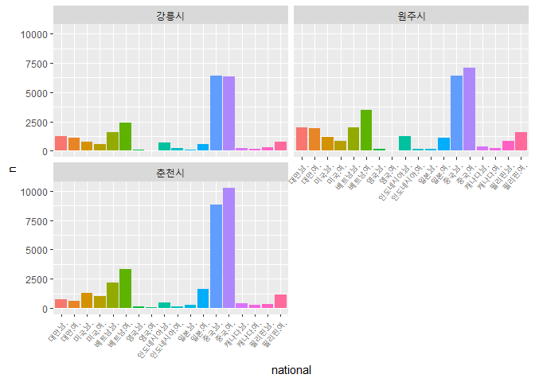

강원도 거주 외국인 비율
================
주윤하
2020 8 19

## 강원도 거주 외국인 비율 분석

단일 민국 국가였던 대한민국에도 거주하는 외국인들의 수가 증가하고 있는 추세입니다. 결혼, 직장, 학업 등 다양한 이유로 한국에
거주하는 외국인을 쉽게 발견할 수 있는데, 그 중 강원도에 거주하는 외국인의 비율을 분석해보도록 하겠습니다.

### 사용할 데이터 로드

``` r
national <- read.csv("강원도_주요국적별 외국인 등록현황 통계_20181231.csv")
head(national)
```

    ##   시군별 연도별 중국.남. 중국.여. 미국.남. 미국.여. 베트남.남. 베트남.여.
    ## 1 춘천시   2000      139      130       72       69         37          2
    ## 2 원주시   2000      228      148       60       43         12         13
    ## 3 강릉시   2000      159      111       55       31         35          4
    ## 4 동해시   2000       26       29       13        4          0          0
    ## 5 태백시   2000        5       10        9        4          0          1
    ## 6 속초시   2000       10       17       18        7          0          3
    ##   일본.남. 일본.여. 영국.남. 영국.여. 필리핀.남. 필리핀.여. 대만.남. 대만.여.
    ## 1       21       57       NA       NA         23         19       38       35
    ## 2        4       46       NA       NA         24         16       66       68
    ## 3        1       25       NA       NA         12         13       85       83
    ## 4        2        7       NA       NA        378        104       15       14
    ## 5        0        8       NA       NA          1          0        0        0
    ## 6        4       26       NA       NA          0         11       18       15
    ##   인도네시아.남. 인도네시아.여. 캐나다.남. 캐나다.여.
    ## 1              4              0         18          9
    ## 2             24             10         12         10
    ## 3             11              5         12         16
    ## 4             41             26          0          0
    ## 5              0              0          4          0
    ## 6              3              5          7          7

``` r
as_tibble(national)
```

    ## # A tibble: 342 x 20
    ##    시군별 연도별 중국.남. 중국.여. 미국.남. 미국.여. 베트남.남. 베트남.여.
    ##    <chr>   <int>    <int>    <int>    <int>    <int>      <int>      <int>
    ##  1 춘천시   2000      139      130       72       69         37          2
    ##  2 원주시   2000      228      148       60       43         12         13
    ##  3 강릉시   2000      159      111       55       31         35          4
    ##  4 동해시   2000       26       29       13        4          0          0
    ##  5 태백시   2000        5       10        9        4          0          1
    ##  6 속초시   2000       10       17       18        7          0          3
    ##  7 삼척시   2000       14        7        5        2          0          0
    ##  8 홍천군   2000       29       27        0        1          0          0
    ##  9 횡성군   2000       23       20        7        1         10          3
    ## 10 영월군   2000        3        5        2        3          0          0
    ## # ... with 332 more rows, and 12 more variables: 일본.남. <int>,
    ## #   일본.여. <int>, 영국.남. <int>, 영국.여. <int>, 필리핀.남. <int>,
    ## #   필리핀.여. <int>, 대만.남. <int>, 대만.여. <int>, 인도네시아.남. <int>,
    ## #   인도네시아.여. <int>, 캐나다.남. <int>, 캐나다.여. <int>

### 강원도 전체에 거주하는 외국인의 국가별 비율

먼저 강원도 전체에 거주하는 외국인의 국가별 비율을 확인해보도록 하겠습니다.

``` r
gangwon <- national %>% 
  pivot_longer(c(`중국.남.`, `중국.여.`, `미국.남.`, `미국.여.`,`베트남.남.`,`베트남.여.`, `일본.남.`, `일본.여.`, `영국.남.`, `영국.여.`, `필리핀.남.`, `필리핀.여.`, `대만.남.`, `대만.여.`, `인도네시아.남.`, `인도네시아.여.`, `캐나다.남.`, `캐나다.여.`), names_to="national", values_to="n")

gangwon1 <- gangwon %>% 
  filter(!is.na(n)) %>% 
  group_by(national) %>% 
  summarise(count=n())
```

    ## `summarise()` ungrouping output (override with `.groups` argument)

``` r
ggplot(data=gangwon1, aes(x=reorder(national, count), y=count)) + geom_col()+
  coord_flip()
```

<!-- -->

위 표에서 보면, 가장 많은 국적은 ’필리핀’이고 그 뒤로 중국, 일본 임을 알 수 있습니다. 특히 입국자 중 ’여성’의 비중이
남성보다 높음을 알 수 있습니다.

### 강원도 중 시 별 외국인 거주 외국인 비유

외국인들이 가장 거주를 많이하는 ’시’는 어디일지 확인해보도록 하겠습니다.

``` r
gangwon2 <- gangwon %>% 
  select(시군별, n) %>% 
 group_by(시군별) %>% 
  filter(!is.na(n))

ggplot() + 
  geom_col(gangwon2, mapping=aes(x=reorder(시군별, -n), y=n))+coord_flip()
```

<!-- -->

그래프를 확인해보면 외국인이 가장 많은 곳은 춘천시이고, 그 뒤로 원주시, 강릉시가 많은 것으로 나타났습니다. 그렇다면 춘천시,
원주시, 강릉시 3곳에 거주하는 외국인의 국적을 분석해 보도록 하겠습니다.

``` r
map2 <- get_map('춘천시')
```

    ## Source : https://maps.googleapis.com/maps/api/staticmap?center=%EC%B6%98%EC%B2%9C%EC%8B%9C&zoom=10&size=640x640&scale=2&maptype=terrain&language=en-EN&key=xxx-nUagRjY_cRUDrZl-AAG0UuuC9-o8

    ## Source : https://maps.googleapis.com/maps/api/geocode/json?address=%EC%B6%98%EC%B2%9C%EC%8B%9C&key=xxx-nUagRjY_cRUDrZl-AAG0UuuC9-o8

``` r
var1 <- gangwon %>% 
  filter(시군별 %in% c("춘천시","원주시","강릉시"))%>% 
  group_by(시군별)

ggplot()+
  geom_col(var1, mapping=aes(x= national, y=n, fill=national))+
  facet_wrap(~시군별, nrow=2) +
  theme(axis.text.x = element_text(angle=50, hjust=1, size=7))+
  theme(legend.position="none")
```

    ## Warning: Removed 30 rows containing missing values (position_stack).

<!-- -->

위 그래프에서 보면 3군데 지역 모두 외국인의 구성비가 비슷함을 알 수 있습니다. 가장 많은 국적은 중국이며 그 다음으로 많은
국적은 베트남입니다.
