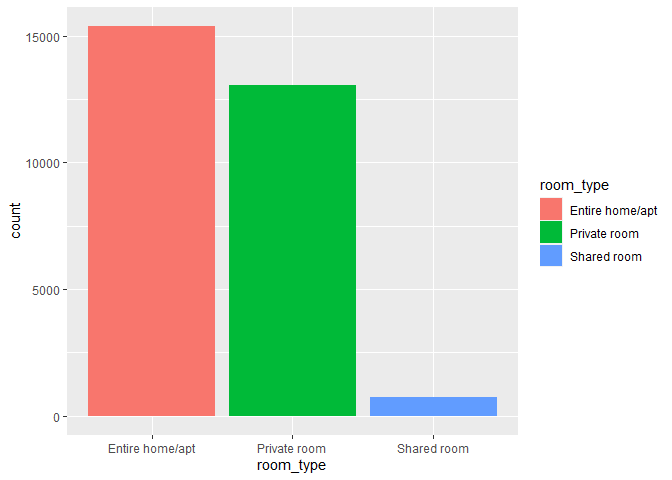
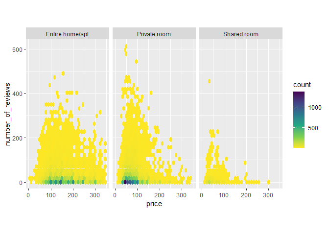
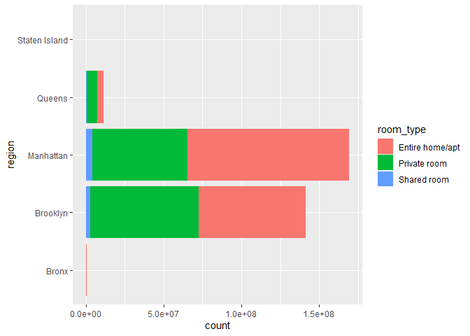
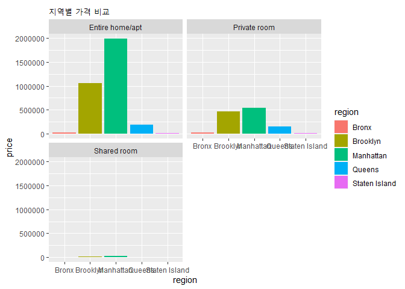
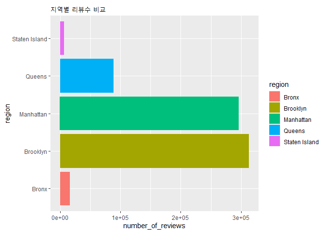

미국 에어비앤비 분석
================
주윤하
2020 8 21

# 뉴욕 에어비앤비 분석

에어비앤비는 단기간 방이 필요한 사람들에게 숙소를 빌려주는 사이트로 저렴하게 방을 빌리고자 하는 사람들이 많이 찾는 사이트입니다.
뉴욕에 위치한 방들의 특징을 살펴보도록 하겠습니다.

### 데이터 로드 및 전처리

해당 데이터를 로드 후 살펴보니 숫자를 기입해야하는 변수에도 문자값이 섞어있어 room\_type기준 대표변수 3개만 추출 후
분석을 진행하도록 하겠습니다.

``` r
nybnb <- read.csv("AB_NYC_2019.CSV")
```

    ## Warning in scan(file = file, what = what, sep = sep, quote = quote, dec = dec, :
    ## 따옴표로 묶인 문자열내에 EOF가 있습니다

``` r
nybnb1 <- nybnb %>% 
  rename(long=longitude,
          lat=latitude,
         region=neighbourhood_group) %>% 
  select(room_type, region, price, number_of_reviews)

room_type <- nybnb1 %>% 
  group_by(room_type) %>% 
  summarise(count=n()) %>% 
  arrange(-count) %>% 
  head(3)
```

    ## `summarise()` ungrouping output (override with `.groups` argument)

``` r
nybnb1 <- nybnb1 %>% 
  filter(room_type %in% c("Entire home/apt","Private room","Shared room")) 
```

### 1\. 뉴욕에 있는 에어비앤비 중 가장 많은 방의 형태는?

``` r
ggplot() +
  geom_col(room_type, mapping=aes(x=room_type, y=count, fill = room_type))
```

<!-- -->

위 그래프를 확인해보면 집 전체를 빌려주거나 아파트 형태로 된 방이 가장 많고, 가장 적은 것은 쉐어룸이라는 것을 확인할 수
있습니다.

그렇다면 실제로 사람들이 가장 많이 렌트하는 집의 형태는 어떨까요.

### 2\. 뉴욕 방문자들이 가장 선호하는 방의 형태는 ?

``` r
nybnb1$number_of_reviews<-as.numeric(nybnb1$number_of_reviews)
str(nybnb1$number_of_reviews)
```

    ##  num [1:29174] 9 45 0 270 9 74 49 430 118 160 ...

``` r
nybnb1$price <- as.numeric(nybnb1$price)

reviews<-nybnb1 %>% 
  group_by(room_type) %>% 
  filter(price <346)


ggplot() +
  geom_hex(reviews, mapping=aes(y=number_of_reviews, x=price))+
  facet_wrap(~room_type, ncol=3)+
  coord_equal()+
  scale_fill_viridis_c(direction=-1)
```

<!-- -->

위 그래프는 가격, 리뷰수, 룸타입 3가지 변수를 반영한 그래프 입니다. 내용을 분석해보면 ’아파트 형’의 경우 다른 룸타입에
비해 가격 저항성이 낮다는 것을 알 수 있고, 그래프가 완만한 모양인 것을 볼 때 전체 가격대가 적절히 이용되는 것을 알
수 있습니다.

반대로 프라이빗룸 타입의 경우 가격이 200 미만에 치중되어 있는 것을 보아 가격이 방 선택에 주요 요인임을 알 수 있고 리뷰수가
가장 많은 방은 가격 값이 100인 부근에 몰려있음을 알 수 있습니다.

마지막으로 쉐어룸의 경우 리뷰수도 많지 않으며 가격대는 100 미만에 많이 몰려있음을 알 수 있습니다.

count값을 보면 아파트형과 프라이빗형의 경우 아래쪽에 몰려있는데, 리뷰가 없는 숙소도 많은 것을 알 수 있습니다.

### 3\. 지역별 보유 룸타입 분석

``` r
region <- nybnb1 %>% 
  group_by(region) %>% 
  mutate(count=n())

region <- region %>% 
  mutate(pct=count/sum(count)) %>% 
  group_by(region)

ggplot()+
  geom_col(region, mapping=aes(x=region, y=count, fill=room_type))+
  coord_flip()
```

<!-- -->

지역별 운영 중인 에어비앤비의 수를 룸타입별로 확인해보면 맨하탄이 전체 에어비엔비 수가 가장 많으며 그 다음이 브루클린 임을 알
수 있습니다. 또한 맨하탄의 경우 아파트형 숙소의 비율이 족므 더 높고 브루클린은 프라이빗룸 형태가 조금 더 많음을 알 수
있습니다.

### 3-1. 지역별 보유 룸타입 분셕(리뷰/가격)

``` r
ggplot()+
  geom_col(region, mapping=aes(x=price, y=region, fill=region))+
  facet_wrap(~room_type, nrow=2)+
  coord_flip() +
  ggtitle("지역별 가격 비교")
```

<!-- -->

``` r
ggplot(region, mapping=aes(x=number_of_reviews, y=region, fill=region))+geom_col()+
  ggtitle("지역별 리뷰수 비교")
```

<!-- -->

가격비교 그래프를 보면 아파트형의 경우 맨하탄의 방값이 다른 곳에 비해 월등히 높다는 것을 알 수 있습니다. 프라이빗 룸의 경우도
브루클린에 비해 맨하탄의 가격이 높습니다.

리뷰수 비교 그래프를 보면 에어비엔비 보유량이 확연히 높은 맨하탄보다 브루클린의 리뷰수가 더 높음을 알 수 있습니다.

### 결론

뉴욕에 있는 에어비엔비의 가격, 방 형태, 지역, 리뷰수라는 4가지의 변수를 사용하여 분석해보았습니다. 뉴욕에 있는 에어비엔비는
맨하탄에 가장 집중되어 있으며, 그 다음으로 많은 지역은 브루클린입니다. 맨하탄은 다른 지역보다 방값이 높은 것으로
확인되었으며, 그 중 아파트형 방의 경우 타 지역에 비해 가격이 월등히 높았습니다. 해당 방의 특징은 가격,
리뷰수, 룸타입 3가지 변수로 시각화한 그래프에서 확인한 것처럼 가격저항성이 낮다는 것을 추측해 볼 수 있습니다.

브루클린은 프라이빗한 형태의 방이 많았으며, 해당 방은 가격이 200 이하에 리뷰수가 집중되어 있는 것을 볼 때 가격이 방 선택에
영향을 주는 것으로 추측해 볼 수 있습니다.
