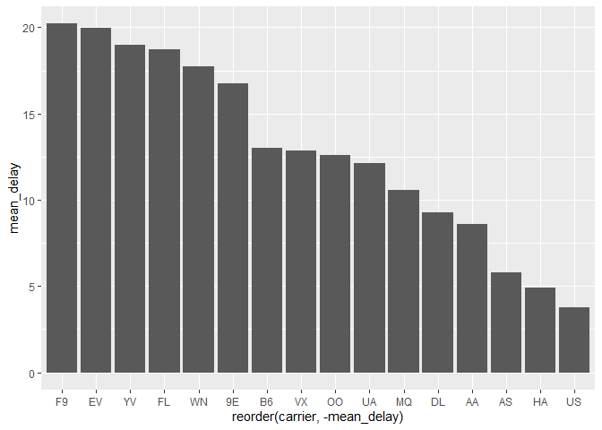
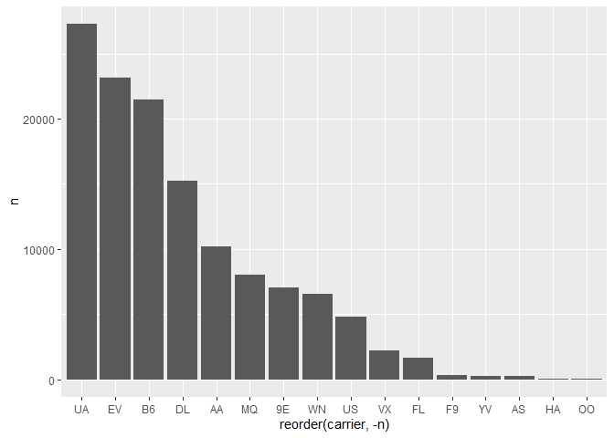
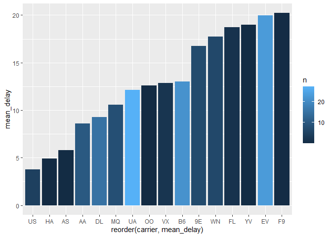

미국 항공기 운항기록 분석
================
주윤하
August 9, 2020

# 미국 항공기 운항기록 분석

nycflights13이라는 패키지 안에 있는 flights라는 데이터를 활용하여 다양한 질문을 통해 분석을 해보려고 합니다.

## Q1. 미국 항공사별 출발 지연이 가장 긴 곳은?

### 분석과정

  - 데이터 불러오기 및 전처리
  - 전처리 데이터를 바탕으로 분석표 작성
  - 분석표를 바탕으로 그래프 작성, 분석

#### 데이터 불러오기 및 형태 확인

어떤 변수명을 사용할지, 해당 변수의 값이 범위인지 연속성인지 확인합니다. 추가적으로 해당 변수에 결측치를 확인합니다.

``` r
head(flights)
```

    ## # A tibble: 6 x 19
    ##    year month   day dep_time sched_dep_time dep_delay arr_time sched_arr_time
    ##   <int> <int> <int>    <int>          <int>     <dbl>    <int>          <int>
    ## 1  2013     1     1      517            515         2      830            819
    ## 2  2013     1     1      533            529         4      850            830
    ## 3  2013     1     1      542            540         2      923            850
    ## 4  2013     1     1      544            545        -1     1004           1022
    ## 5  2013     1     1      554            600        -6      812            837
    ## 6  2013     1     1      554            558        -4      740            728
    ## # ... with 11 more variables: arr_delay <dbl>, carrier <chr>, flight <int>,
    ## #   tailnum <chr>, origin <chr>, dest <chr>, air_time <dbl>, distance <dbl>,
    ## #   hour <dbl>, minute <dbl>, time_hour <dttm>

``` r
glimpse(flights)
```

    ## Rows: 336,776
    ## Columns: 19
    ## $ year           <int> 2013, 2013, 2013, 2013, 2013, 2013, 2013, 2013, 2013...
    ## $ month          <int> 1, 1, 1, 1, 1, 1, 1, 1, 1, 1, 1, 1, 1, 1, 1, 1, 1, 1...
    ## $ day            <int> 1, 1, 1, 1, 1, 1, 1, 1, 1, 1, 1, 1, 1, 1, 1, 1, 1, 1...
    ## $ dep_time       <int> 517, 533, 542, 544, 554, 554, 555, 557, 557, 558, 55...
    ## $ sched_dep_time <int> 515, 529, 540, 545, 600, 558, 600, 600, 600, 600, 60...
    ## $ dep_delay      <dbl> 2, 4, 2, -1, -6, -4, -5, -3, -3, -2, -2, -2, -2, -2,...
    ## $ arr_time       <int> 830, 850, 923, 1004, 812, 740, 913, 709, 838, 753, 8...
    ## $ sched_arr_time <int> 819, 830, 850, 1022, 837, 728, 854, 723, 846, 745, 8...
    ## $ arr_delay      <dbl> 11, 20, 33, -18, -25, 12, 19, -14, -8, 8, -2, -3, 7,...
    ## $ carrier        <chr> "UA", "UA", "AA", "B6", "DL", "UA", "B6", "EV", "B6"...
    ## $ flight         <int> 1545, 1714, 1141, 725, 461, 1696, 507, 5708, 79, 301...
    ## $ tailnum        <chr> "N14228", "N24211", "N619AA", "N804JB", "N668DN", "N...
    ## $ origin         <chr> "EWR", "LGA", "JFK", "JFK", "LGA", "EWR", "EWR", "LG...
    ## $ dest           <chr> "IAH", "IAH", "MIA", "BQN", "ATL", "ORD", "FLL", "IA...
    ## $ air_time       <dbl> 227, 227, 160, 183, 116, 150, 158, 53, 140, 138, 149...
    ## $ distance       <dbl> 1400, 1416, 1089, 1576, 762, 719, 1065, 229, 944, 73...
    ## $ hour           <dbl> 5, 5, 5, 5, 6, 5, 6, 6, 6, 6, 6, 6, 6, 6, 6, 5, 6, 6...
    ## $ minute         <dbl> 15, 29, 40, 45, 0, 58, 0, 0, 0, 0, 0, 0, 0, 0, 0, 59...
    ## $ time_hour      <dttm> 2013-01-01 05:00:00, 2013-01-01 05:00:00, 2013-01-0...

``` r
table(is.na(flights$dep_delay))
```

    ## 
    ##  FALSE   TRUE 
    ## 328521   8255

#### 새로운 데이터에 필요 변수 추출

이상치를 제거하고 사용할 변수만 선택 후 항공사별로 묶어서 지연시간의 평균을 구합니다.

``` r
origin_fli <- flights %>% 
  filter(!is.na(dep_delay))%>%
  select(dep_delay, origin, dest, distance,carrier) %>% 
  group_by(carrier) %>% 
  summarise(mean_delay = mean(dep_delay))
```

    ## `summarise()` ungrouping output (override with `.groups` argument)

#### 그래프 만들기

앞서 만든 데이터를 사용하여 그래프를 만들도록 하겠습니다.

``` r
ggplot(origin_fli) + 
  geom_col(aes(x=reorder(carrier, -mean_delay), y=mean_delay))
```

<!-- -->

표를 보면 미국 항공사 중 F9, EV, YV, FL, WN, 9E가 타 항공사에 비해 지연시간이 확연히 길다는 것을 알 수
있었습니다.

## Q2. 지연 빈도수는 어떤 항공사가 많을까

지연 시간의 평균은 해당 항공사에 특별한 이슈가 있었을 가능성이 있어, 위의 자료만으로 항공사의 서비스 품질을 평가하기에는 섣부른
경향이 있습니다. 따라서 지연 빈도수를 분석한 뒤 위 그래프와 비교하여 최종적으로 분석하도록 하겠습니다.

### 분석과정

  - 데이터 불러오기 및 전처리
  - 전처리 데이터를 바탕으로 분석표 작성
  - 분석표를 바탕으로 그래프 작성, 분석

#### 사용할 데이터 전처리

이번에는 지연시간이 0이상인 건수만 고른 다음 항공사별로 묶어 평균이 아닌 count를 해보도록 하겠습니다.

``` r
delay_count <- flights %>%
  select(dep_delay, origin, dest, distance,carrier) %>% 
  filter(dep_delay>0) %>% 
  group_by(carrier) %>% 
  summarise(n=n())
```

    ## `summarise()` ungrouping output (override with `.groups` argument)

#### 위에서 만든 데이터로 그래프를 그려보도록 하겠습니다.

``` r
ggplot(delay_count)+geom_col(aes(x=reorder(carrier, -n), y=n))
```

<!-- -->

지연 빈도가 가장 높은 회사는 UA, EV, B6입니다. 앞서 언급된 항공사 중 중복되는 항공사는 EV로 해당 항공사는 지연빈도
뿐만 아니라 지연시간도 긴 것으로 알 수 있습니다.

#### 2가지 변수가 있는 그래프 만들기

지연 평균과 빈도가 함께 있는 그래프를 그려 명확하게 표현해보도록 하겠습니다.

``` r
delay_count$n <- delay_count$n/1000
origin_fli <- origin_fli %>% left_join(delay_count, by="carrier")
head(origin_fli)
```

    ## # A tibble: 6 x 3
    ##   carrier mean_delay      n
    ##   <chr>        <dbl>  <dbl>
    ## 1 9E           16.7   7.06 
    ## 2 AA            8.59 10.2  
    ## 3 AS            5.80  0.226
    ## 4 B6           13.0  21.4  
    ## 5 DL            9.26 15.2  
    ## 6 EV           20.0  23.1

``` r
ggplot(origin_fli,aes(x=reorder(carrier,mean_delay), y=mean_delay, fill=n), position="dodge")+
  geom_col()
```

<!-- -->

두가지 내용을 합한 그래프를 확인해보면 딜레이 시간의 평균이 높으면서 빈도가 높은 것은 EV항공사임을 확연히 알 수 있습니다.
