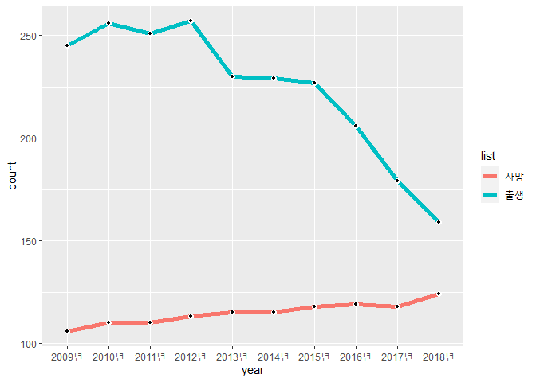
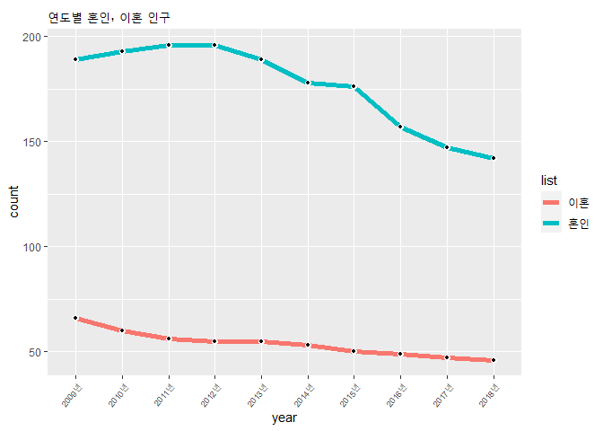
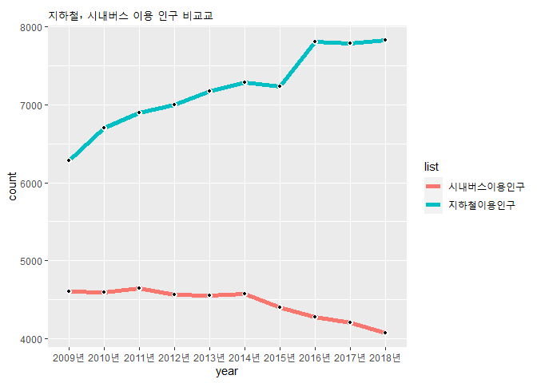
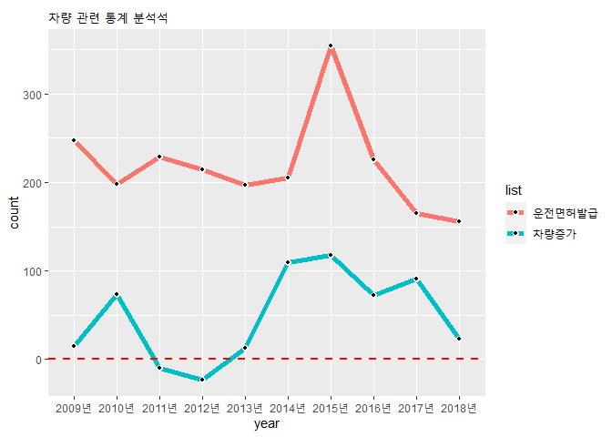

서울 인구데이터 분석
================
주윤하

### 사용할 데이터 로드

``` r
data <- read_excel("seouldata.xls")
head(data)
```

    ## # A tibble: 6 x 12
    ##   항목  단위  `2018년` `2017년` `2016년` `2015년` `2014년` `2013년` `2012년`
    ##   <chr> <chr> <chr>    <chr>    <chr>    <chr>    <chr>    <chr>    <chr>   
    ## 1 출생  명    159      179      206      227      229      230      257     
    ## 2 사망  명    124      118      119      118      115      115      113     
    ## 3 혼인  쌍    142      147      157      176      178      189      196     
    ## 4 이혼  쌍    46       47       49       50       53       55       55      
    ## 5 인구이동~ 명    5507     5549     5764     5991     5855     5720     5861    
    ## 6 통행인구~ 천통행~ -        -        -        32410    32690    32516    32150   
    ## # ... with 3 more variables: `2011년` <chr>, `2010년` <chr>, `2009년` <chr>

``` r
glimpse(data)
```

    ## Rows: 27
    ## Columns: 12
    ## $ 항목     <chr> "출생", "사망", "혼인", "이혼", "인구이동", "통행인구", "지하철이용인구", "시내버스이용인구...
    ## $ 단위     <chr> "명", "명", "쌍", "쌍", "명", "천통행", "천명", "천명", "대", "명", "건", "...
    ## $ `2018년` <chr> "159", "124", "142", "46", "5507", "-", "7824", "4074", "23...
    ## $ `2017년` <chr> "179", "118", "147", "47", "5549", "-", "7792", "4200", "91...
    ## $ `2016년` <chr> "206", "119", "157", "49", "5764", "-", "7805", "4280", "72...
    ## $ `2015년` <chr> "227", "118", "176", "50", "5991", "32410", "7234", "4403",...
    ## $ `2014년` <chr> "229", "115", "178", "53", "5855", "32690", "7290", "4574",...
    ## $ `2013년` <chr> "230", "115", "189", "55", "5720", "32516", "7177", "4548",...
    ## $ `2012년` <chr> "257", "113", "196", "55", "5861", "32150", "6994", "4565",...
    ## $ `2011년` <chr> "251", "110", "196", "56", "6415", "31885", "6899", "4645",...
    ## $ `2010년` <chr> "256", "110", "193", "60", "6524", "31155", "6703", "4595",...
    ## $ `2009년` <chr> "245", "106", "189", "66", "6882", "31948", "6282", "4605",...

### 데이터 전처리

``` r
data1 <- data %>% 
  pivot_longer(c(`2018년`,`2017년`,`2016년`,`2015년`,`2014년`,`2013년`,`2012년`,`2011년`,`2010년`,`2009년`), names_to='year', values_to='count')

data1 <- rename(data1, list=항목,
                filter=단위)

data1$count<-as.numeric(data1$count)
```

    ## Warning: 강제형변환에 의해 생성된 NA 입니다

### 출생, 사망 인구의 비교

``` r
birth.death <-  data1 %>% 
  filter(list %in% c('출생', '사망')) %>% 
  group_by(year)

ggplot(birth.death, aes(x=year, y=count)) + 
  geom_line(size=2, aes(group=list, colour=list))+geom_point(size=2, color='white')+
  geom_point(size=1, color='black')
```

<!-- -->

### 혼인, 이혼 인구의 비교

``` r
m.d <-  data1 %>% 
  filter(list %in% c('이혼', '혼인')) %>%
  group_by(year)


ggplot(m.d, aes(x=year, y=count)) + 
  geom_line(size=2, aes(group=list, colour=list))+geom_point(size=2, color='white')+
  geom_point(size=1, color='black')+
  ggtitle("연도별 혼인, 이혼 인구")+
  theme(axis.text.x = element_text(angle=50, hjust=1, size=7))
```

<!-- -->

### 교통수단 분석

``` r
tf <- data1 %>% 
  filter(list %in% c('지하철이용인구', '시내버스이용인구')) %>%
  group_by(list)


ggplot(data=tf, aes(x=year, y=count, color=list)) +
  geom_line(size=2, aes(group=list, colour=list))+
  geom_point(size=2, color='white')+
  geom_point(size=1, color='black')+
  ggtitle("지하철, 시내버스 이용 인구 비교교")
```

<!-- -->

### 차량 관련 분석

``` r
car1 <- data1 %>% 
  filter(list %in% c('운전면허발급', '차량증가')) %>% 
  select(-filter) %>% 
  pivot_wider(names_from=list, values_from=count)

car2 <- data1 %>% 
  filter(list %in% c('운전면허발급', '차량증가', '교통사망사고')) %>% 
  select(-filter)

ggplot(data=car2, aes(x=year, y=count, fill=list))+
  geom_line(size=2, aes(group=list, colour=list))+
  geom_point(size=2, color='white')+
  geom_point(size=1, color='black')+
  ggtitle("차량 관련 통계 분석석")+
  geom_hline(yintercept=0, linetype='dashed', color='red', size=1)
```

<!-- -->

``` r
cor.test(car1$차량증가, car1$운전면허발급)
```

    ## 
    ##  Pearson's product-moment correlation
    ## 
    ## data:  car1$차량증가 and car1$운전면허발급
    ## t = 0.83888, df = 8, p-value = 0.4259
    ## alternative hypothesis: true correlation is not equal to 0
    ## 95 percent confidence interval:
    ##  -0.4205774  0.7751887
    ## sample estimates:
    ##       cor 
    ## 0.2843455
