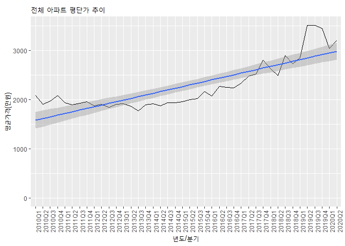
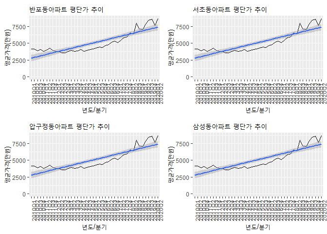
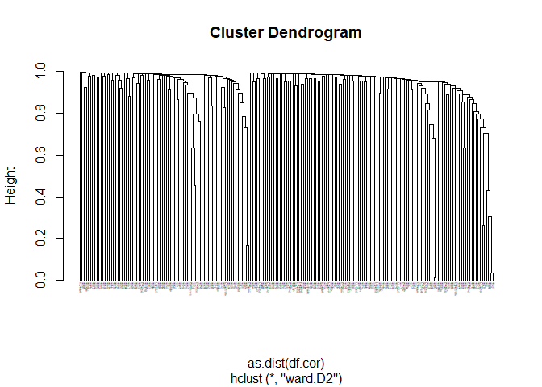
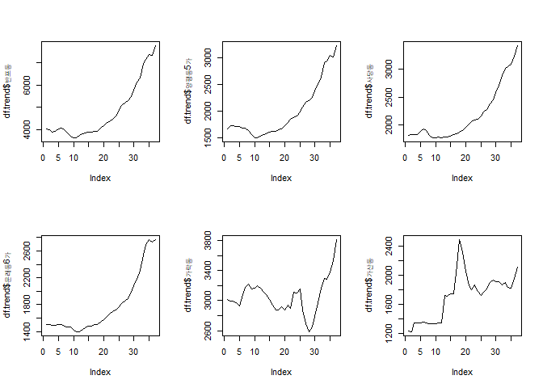

서울 아파트 가격 분석
================
주윤하
Sep 14, 2020

## 서울 아파트 가격 분석

1.  자료

분석하고자 하는 해당 자료는 공공데이터포털에서 가져왔습니다. 서울의 지역별 아파트가격의 추이를 나타내는 자료입니다.

2.  분석목적

강남의 아파트 가격 상승세의 추이를 분석해보고, 강남의 아파트 가격 추세와 유사한 흐름을 보이는

지역의 가격 하락, 상승을 예측해보고자 합니다.

추가적으로 지역별 집값이 어떠한 형태로 변화되어오는지도 분석해보도록 하겠습니다.

3.  가설

\*강남의 아파트 가격은 상승세를 보이고 있을 것이고, 이 흐름과 유사한 흐름을 보이는 지역이 존재 할 것이다.

\*2010년 이후 서울의 집값은 지속적으로 상승했을 것이다.

#### 1\. 데이터 로드 및 전처리

``` r
data <- read.csv("apt_data_2010_2020.csv")
```

#### 2\. 서울 아파트 가격 변동 추이

``` r
df1 <- data %>% 
  group_by(yyyyqrt) %>% 
  summarise(평균평단가=mean(평단가))
```

    ## `summarise()` ungrouping output (override with `.groups` argument)

``` r
ggplot(data=df1, aes(x=yyyyqrt, y=평균평단가, group=1))+
  geom_line()+
  xlab('년도/분기')+ylab('평균가격(만원)')+
  ggtitle('전체 아파트 평단가 추이')+
  theme(axis.text.x=element_text(angle=90))+
  stat_smooth(method='lm')+
  ylim(0,max(df1$평균평단가))
```

    ## `geom_smooth()` using formula 'y ~ x'

<!-- -->

위 그래프를 보면 서울의 아파트 가격은 소폭 상승, 하락이 있긴 하지만 꾸준히 상승한 것을 알 수 있습니다.

#### 2-1. 강남 아파트 평균 평단가 추이

``` r
dong <- '반포동'
df2 <- data %>% 
  filter(법정동==dong) %>% 
  group_by(yyyyqrt) %>% 
  summarise(평균평단가=mean(평단가))
```

    ## `summarise()` ungrouping output (override with `.groups` argument)

``` r
ggplot(data=df2, aes(x=yyyyqrt, y=평균평단가, group=1))+
  geom_line()+
  xlab('년도/분기')+ylab('평균가격(만원)')+
  ggtitle(paste0(dong,'아파트 평단가 추이'))+
  theme(axis.text.x=element_text(angle=90))+
  stat_smooth(method='lm')+
  ylim(0,max(df2$평균평단가))->df2.plot


dong1 <- '서초동'
df3 <- data %>% 
  filter(법정동==dong) %>% 
  group_by(yyyyqrt) %>% 
  summarise(평균평단가=mean(평단가))
```

    ## `summarise()` ungrouping output (override with `.groups` argument)

``` r
ggplot(data=df3, aes(x=yyyyqrt, y=평균평단가, group=1))+
  geom_line()+
  xlab('년도/분기')+ylab('평균가격(만원)')+
  ggtitle(paste0(dong1,'아파트 평단가 추이'))+
  theme(axis.text.x=element_text(angle=90))+
  stat_smooth(method='lm')+
  ylim(0,max(df3$평균평단가))->df3.plot


dong2 <- '압구정동'
df4 <- data %>% 
  filter(법정동==dong) %>% 
  group_by(yyyyqrt) %>% 
  summarise(평균평단가=mean(평단가))
```

    ## `summarise()` ungrouping output (override with `.groups` argument)

``` r
ggplot(data=df4, aes(x=yyyyqrt, y=평균평단가, group=1))+
  geom_line()+
  xlab('년도/분기')+ylab('평균가격(만원)')+
  ggtitle(paste0(dong2,'아파트 평단가 추이'))+
  theme(axis.text.x=element_text(angle=90))+
  stat_smooth(method='lm')+
  ylim(0,max(df4$평균평단가))->df4.plot


dong3 <- '삼성동'
df5 <- data %>% 
  filter(법정동==dong) %>% 
  group_by(yyyyqrt) %>% 
  summarise(평균평단가=mean(평단가))
```

    ## `summarise()` ungrouping output (override with `.groups` argument)

``` r
ggplot(data=df5, aes(x=yyyyqrt, y=평균평단가, group=1))+
  geom_line()+
  xlab('년도/분기')+ylab('평균가격(만원)')+
  ggtitle(paste0(dong3,'아파트 평단가 추이'))+
  theme(axis.text.x=element_text(angle=90))+
  stat_smooth(method='lm')+
  ylim(0,max(df5$평균평단가))->df5.plot


grid.arrange(df2.plot, df3.plot, df4.plot, df5.plot, nrow=2, ncol=2)
```

    ## `geom_smooth()` using formula 'y ~ x'

    ## `geom_smooth()` using formula 'y ~ x'
    ## `geom_smooth()` using formula 'y ~ x'
    ## `geom_smooth()` using formula 'y ~ x'

<!-- -->

강남의 아파트 가격은 비숫한 흐름을 보이고 있습니다. 하락과 정체 시기가 있었지만 현재 다시 기존 가격대를 회복하고 있는
모습입니다.

#### 2-2.강남 아파트와 비슷한 추세선을 갖는 지역을 선별, 가격 변동 예측

강남 아파트 가격의 대표값을 ’반포동’으로 지정하고 진행하도록 하겠습니다.

``` r
df.a <- data %>% 
  filter(!yyyyqrt %in% c('2020Q1','2020Q2'))

dong.list <- unique(data$법정동)
```

``` r
dong.list <- df.f %>% group_by(x) %>% 
  summarise(cnt=n_distinct(yyyyqrt)) %>% 
  filter(cnt==38) %>% select(x)
```

    ## `summarise()` ungrouping output (override with `.groups` argument)

``` r
banpo <- df.f %>% filter(x=='반포동')
df.f <- df.f %>% filter(!x == '반포동')


df.trend <- list()

for(i in dong.list$x){
  
  temp <- df.f %>% filter(x==i) %>% select(mp3) %>% as.matrix()
  df.trend[[i]]<-temp[,1]
                                                              
}

df.trend <- as.data.frame(do.call(cbind,df.trend)) 

banpo <- banpo[-38,] %>% select(mp3)
colnames(banpo)<-'반포동'

df.trend <- df.trend[-1,]
df.trend <- cbind(df.trend, banpo)

df.cor <- cor(df.trend)
hc <- hclust(as.dist(df.cor), method='ward.D2')
plot(hc, hang=-1, cex=0.25)
```

<!-- -->

``` r
cor.banpo <- df.cor[197,1:197] %>% as.data.frame() %>% arrange()

par(mfrow=(c(2,3)))
plot(df.trend$반포동, type='l')
plot(df.trend$양평동5가, type='l')
plot(df.trend$사당동, type='l')
plot(df.trend$문래동6가, type='l')
plot(df.trend$가락동, type='l')
plot(df.trend$가산동, type='l')
```

<!-- -->

#### 3\. 결론

<가설1>

1)  강남의 아파트 가격은 상승세를 보이고 있을 것이고, 이 흐름과 유사한 흐름을 보이는 지역이 존재 할 것이다.

\*강남의 아파트 가격은 전반적으로 유사한 형태로 상승세를 보이고 있습니다.

\*강남지역 외에 지역에서도 유사한 추세를 보이는 지역들이 존재합니다.

따라서, 추가적인 자료는 반드시 필요하나 비슷한 추세를 보이는 지역들은 집값이 상승할 것으로 조심스럽게 예측해 볼 수 있습니다.

<가설2>

2)  2010년 이후 서울의 집값은 지속적으로 상승했을 것이다.

\*2010년 이후 서울의 집값은 소폭 오르고 내리기를 반복하지만, 지속적으로 오르고 있음을 알 수 있습니다.

\*지역에 따라 평균평단가의 변동이 큰 지역들이 있습니다.
