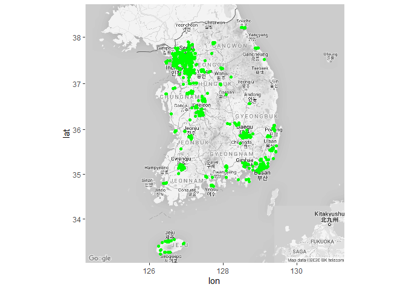
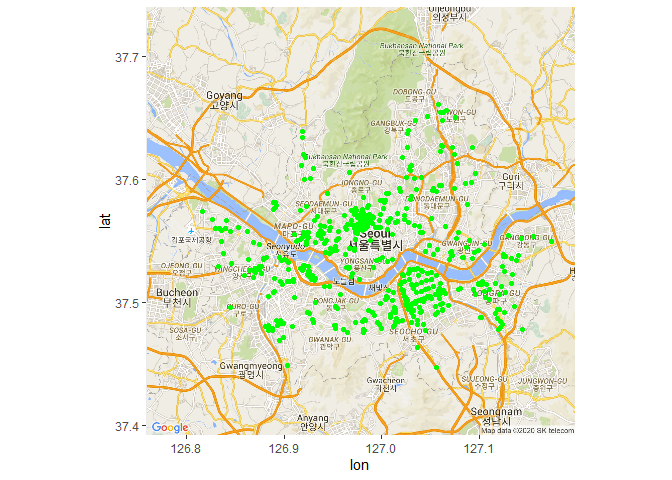
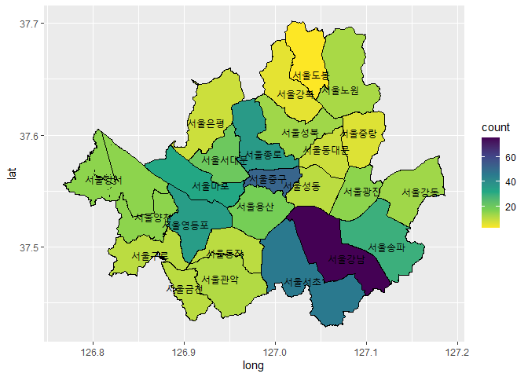

스타벅스 분포도 분석
================
주윤하
August 19, 2020

# 스타벅스 분포도 분석

한국 사회에서 어느 순간부터 커피는 매우 중요한 일상으로 자리 잡았습니다. 그 중 한국사람들에게 인기가 많은 ’스타벅스’라는
브랜드는 한때 비싼 커피로 여겨져 일부 부정적인 시선도 있었지만 지금까지 꾸준히 사랑받는 커피 브랜드로 자리잡았습니다.
그렇다면 고가 커피브랜드로 알려진 스타벅스는 한국에 얼마나 분포되어 있는지 분석을 통해 확인해보도록 하겠습니다.

### 사용할 파일 로드

분석에 사용할 스타벅스 매장 위치정보와 대한민국 지도를 로드합니다.

``` r
star <- read.csv("starbucks.csv")
korea <- get_map(location="south korea", zoom=7, maptype="roadmap", color="bw")
```

    ## Source : https://maps.googleapis.com/maps/api/staticmap?center=south%20korea&zoom=7&size=640x640&scale=2&maptype=roadmap&language=en-EN&key=xxx-nUagRjY_cRUDrZl-AAG0UuuC9-o8

    ## Source : https://maps.googleapis.com/maps/api/geocode/json?address=south+korea&key=xxx-nUagRjY_cRUDrZl-AAG0UuuC9-o8

### 지도에 데이터 값 표시

``` r
ggmap(korea)+
  geom_point(data=star, aes(x=long, y=lat), color="green")
```

<!-- -->

지도를 보면 큰 대도시 중심으로 스타벅스가 많이 위치하는 것을 알 수 있습니다. 그 중에서도 서울, 수도권에 집중적으로 분포되어
있는 것을 확인 할 수 있습니다.

### 서울 내 스타벅스의 분포도

``` r
map <- get_map("seoul", zoom=11, maptype="roadmap")
```

    ## Source : https://maps.googleapis.com/maps/api/staticmap?center=seoul&zoom=11&size=640x640&scale=2&maptype=roadmap&language=en-EN&key=xxx-nUagRjY_cRUDrZl-AAG0UuuC9-o8

    ## Source : https://maps.googleapis.com/maps/api/geocode/json?address=seoul&key=xxx-nUagRjY_cRUDrZl-AAG0UuuC9-o8

``` r
ggmap(map)+
  geom_point(data=star %>% filter(sido=="서울"), aes(x=long, y=lat),color="green")
```

<!-- -->

서울 내에서 분포를 보면 서울 강남, 서울 중구에 주로 위치해 있는 것을 확인할 수 있습니다. 구 별 분포정도를 확인해기 위해
geom\_map을 사용하여 분석합니다.

``` r
seoul1 <- seoul %>% 
  group_by(code) %>% 
  summarise(mean_long=mean(long))
```

    ## `summarise()` ungrouping output (override with `.groups` argument)

``` r
seoul2<- seoul %>% 
  group_by(code) %>% 
  summarise(mean_lat=mean(lat)) %>% 
  right_join(seoul1)
```

    ## `summarise()` ungrouping output (override with `.groups` argument)

    ## Joining, by = "code"

``` r
star1 <- star %>% 
  filter(sido=='서울') %>% 
  group_by(code) %>% 
  summarise(count=n()) %>% 
  right_join(seoul)
```

    ## `summarise()` ungrouping output (override with `.groups` argument)
    ## Joining, by = "code"

``` r
ggplot(data=star1, aes(x=long, y=lat)) +
  geom_polygon(aes(group=group, fill=count), color="black")+
  geom_text(data=seoul2, aes(x=mean_long, y=mean_lat, label=code))+
  scale_fill_viridis_c(direction=-1)
```

<!-- -->

구 별로 구분된 위 지도를 보면 스타벅스의 분포는 ’서울 강남’이 압도적으로 많은 것을 알 수 있습니다. 그 다음으로 서초와
중구가 많았습니다. 대부분 오피스 상권에서 스타벅스가 많이 분포되어 있음을 알 수 있습니다.

스타벅스의 분포가 가장 적은 지역은 ’서울 도봉’임을 알 수 있습니다.
