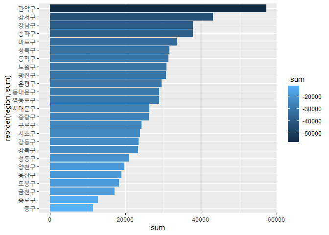
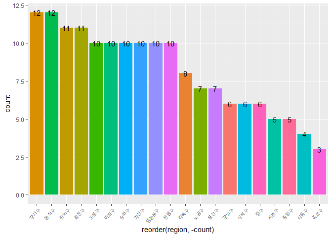
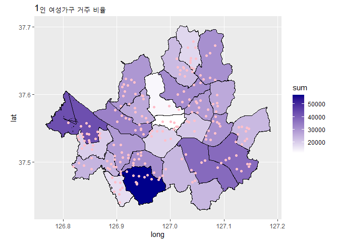
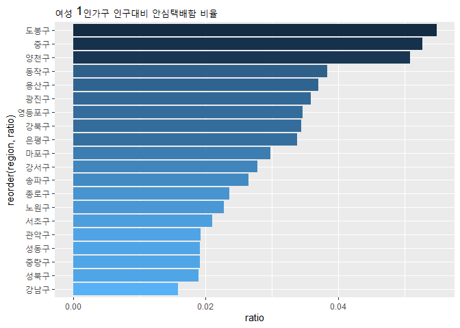

서울공공데이터분석2\_안심택배함
================
주윤하
Sep 05, 2020

\#서울공공데이터 분석 2\_ 안심택배함 설치 현황 분석

1인 가구의 증가로 인해 여러 편리한 시설들이 증가하고 있습니다. 그 중 여성 1인가구의 비중도 높아지고 있는데, 이런 흐름에
맞게 서울시는 안심택배함 배치를 증가시켜 여성이 안심하고 택배를 받을 수 있도록 노력하고 있습니다.

그렇다면 안심택배함이 많이 설치된 지역은 어디인지, 해당 지역의 1인 여성 거주 비율은 어떤지 분석해보도록 하겠습니다.

### 분석단계

  - 사용할 데이터를 로드한 뒤 결측치, 이상치를 처리합니다.
  - 데이터를 전처리하여 분석에 용이하도록 합니다.
  - 시각화 패키지를 사용하여 그래프, 지도로 나타냅니다.

### 사용할 데이터 로드 및 처리

  - 여성안심택배 설치 데이터 로드, 처리

<!-- end list -->

``` r
data <- read.csv("서울특별시 도시생활지도 여성안심택배.csv")

data <- rename (data, 
                long=좌표정보,
                lat=좌표정보.1,
                region =구명)

data <- data %>% 
  group_by(region)
```

  - 서울 지도데이터 로드 및 처리

<!-- end list -->

``` r
seoul_map<- read.csv("seoul(1).csv")
seoul_area_long <- seoul_map %>% 
  group_by(code) %>% 
  summarise(mean_long=mean(long))
```

    ## `summarise()` ungrouping output (override with `.groups` argument)

``` r
seoul_area_lat <- seoul_map %>% 
  group_by(code) %>% 
  summarise(mean_lat=mean(lat))
```

    ## `summarise()` ungrouping output (override with `.groups` argument)

``` r
seoul_area_label <- left_join(seoul_area_long, seoul_area_lat, by='code') %>% 
  rename(region=code)

seoul_map<- rename(seoul_map,
                   region=code)
```

  - 1인가구 거주 데이터 처리

<!-- end list -->

``` r
single <-read.table("report.txt", sep='\t', fill=TRUE, header=T)
single <- rename(single, region=구분,
                  sex=성별,
                  sum=합계)

single$sum <- gsub(",", "", single$sum)
single$sum <- as.numeric(single$sum)
class(single$sum)
```

    ## [1] "numeric"

``` r
single_w <- single %>% 
  filter(sex == '여자') %>% 
  group_by(region)

single_w1<- single_w[-1,] %>% 
  select(sex, sum, region)
```

### 1인 여성가구 지역별 거주 비율

``` r
ggplot(data=single_w1, aes(x=reorder(region, sum), y=sum, fill=-sum))+geom_col()+coord_flip()
```

<!-- -->

### 지역별 여성안심택배 설치 현황 그래프

``` r
data1 <- data %>% 
  group_by(region) %>% 
  summarise(count=n()) %>% 
  arrange(count) %>% 
  head(10)
```

    ## `summarise()` ungrouping output (override with `.groups` argument)

``` r
data2<- data %>% 
  group_by(region) %>% 
  summarise(count=n()) %>% 
  arrange(count) %>% 
  tail(10) %>% 
  rbind(data1)
```

    ## `summarise()` ungrouping output (override with `.groups` argument)

``` r
data2$grade<- ifelse(data2$count >=10, "g", "b")
data2 <- data2 %>% group_by(grade)

ggplot(data=data2, aes(x=reorder(region, -count), y=count, fill=region))+geom_col()+
 theme(axis.text.x = element_text(angle=50, hjust=1, size=7))+
  theme(legend.position="none")+
  geom_text(aes(label=count), color='black')
```

<!-- -->

지역 중 안심택배 보유수량이 가장 많은 지역 10군데, 가장 적은 지역 10군데를 추출하여 그래프로 확인했습니다. 그래프에서
확인해보면 종로구가 가장 적은 수량의 안심택배를 보유하고 있으며, 강서구가 가장 많은 수량을 보유하고 있음을 알 수
있습니다.

### 1인 여성가구 거주 비율, 안심택배함 설치현황 지도분석

``` r
single_w_area <- left_join(seoul_map, single_w1, by='region')

ggplot(data=single_w_area, aes(x=long, y=lat))+
  geom_polygon(aes(group=group, fill=sum), color='black')+
  scale_fill_continuous(low='white', high='darkblue')+
  ggtitle('1인 여성가구 거주 비율')+
  geom_point(data=data, aes(x=long, y=lat), color='pink')+
  coord_map()
```

<!-- -->

지도에서 확인해보면 여성인구의 거주비율이 높더라도 적은 지역보다 안심택배함 설치 수가 적은 곳이 있음을 알 수 있습니다. 보다
정확한 분석을 위해 그래프로 시각화하도록 하겠습니다.

### 1인 여성가구 거주 비율, 안심택배함 설치현황 그래프 분석

``` r
single_count <- single_w1 %>% 
  select(region, sum)

data_single <- left_join(data2, single_count, by='region') %>% 
  mutate(ratio=(count/sum)*100)

ggplot(data=data_single, aes(x=reorder(region, ratio), y=ratio, fill=-ratio))+
  geom_col()+ coord_flip()+
  ggtitle("여성 1인가구 인구대비 안심택배함 비율")+
  theme(legend.position="none")
```

<!-- -->

해당 자료를 확인해보면, 1인 여성가구의 인구 대비 안심택배함의 비율이 높은 곳은 도봉구, 중구, 양천구 순서였습니다. 따라서
여성인구가 높은 관악구, 강서구의 경우 안심택배함의 추가 설치가 필요한 상황임을 알 수 있습니다.
