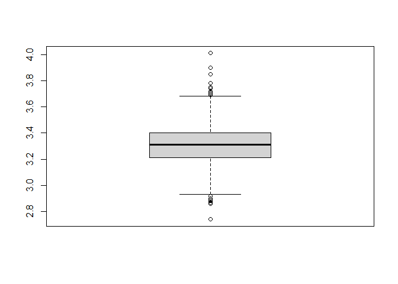
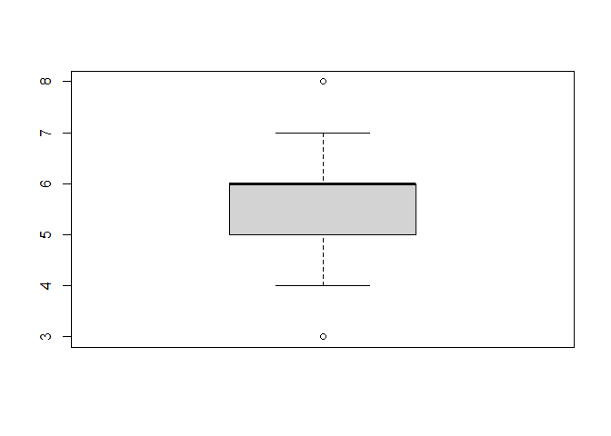
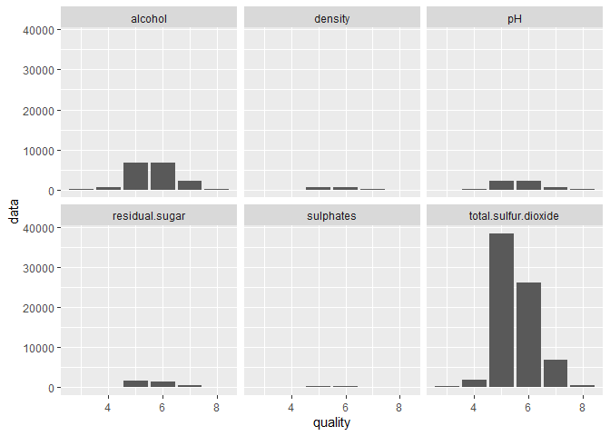

다양한 변수를 통한 와인 분석
================
주윤하
August 13, 2020

# 레드와인의 퀄리티에 영향을 주는 요인 분석

레드와인은 산미, 제조연도, 오크통의 종류, 포도의 품종 등 다양한 요인이 결합하여 카치를 결정합니다. 그렇다면 이 중 어떤
요인이 레드와인의 퀄리티에 큰 영향을 미치는지 분석해보도록 하겠습니다.

### 1\. 데이터 불러오기

사용할 레드와인 데이터를 로드한 뒤 형태를 확인합니다. 총 12가지의 변수로 구성된 데이터 프레임이며, 해당 변수 중 어떤 것을
선택하여 분석할지 선정 후 전처리를 하도록 하겠습니다.

``` r
boxplot(wine_red$pH)$stat
```

<!-- -->

    ##      [,1]
    ## [1,] 2.93
    ## [2,] 3.21
    ## [3,] 3.31
    ## [4,] 3.40
    ## [5,] 3.68

``` r
boxplot(wine_red$quality)$stat
```

<!-- -->

    ##      [,1]
    ## [1,]    4
    ## [2,]    5
    ## [3,]    6
    ## [4,]    6
    ## [5,]    7
    ## attr(,"class")
    ##         1 
    ## "integer"

``` r
class(wine_red$quality)
```

    ## [1] "integer"

### 2\. 데이터 전처리하기

변수를 pivot\_longer를 활용하여 위치 이동 시켜 분석하기 용이하도록 전처리 합니다.

``` r
quality_wine<-wine_red %>% 
  pivot_longer(c(`pH`, `alcohol`, `density`, `sulphates`, `residual.sugar`, `total.sulfur.dioxide`), names_to="type", values_to="data")
```

### 3\. 그래프 그리기

앞서 전처리한 데이터를 사용하여 그래프를 그립니다.

``` r
ggplot(quality_wine, aes(x=quality, y=data))+
  geom_col()+facet_wrap(~type, nrow=2)
```

<!-- -->

### 4\. 그래프 분석

위 그래프에서 확인한 결과 퀄리티가 매우 높거나 낮은 경우 5가지 타입의 변수 모두 값이 적다는 것을 알 수 있었고, 중간에
위치한 퀄리티 5, 6에서 알콜, pH, total.sulfur.dioxide 가 높게 나타나는 것을 알 수
있었습니다.

### 5\. 결론

레드와인 데이터에 담긴 변수와 퀄리티의 상관관계를 분석한 결과 퀄리티에 영향을 끼치는 명확한 요인은 발견할 수 없었습니다. 따라서
각 해당 변수의 데이터 값이 높거나 낮은 이유로 좋은 퀄리티의 와인이라고 결론지을 수 없습니다.
