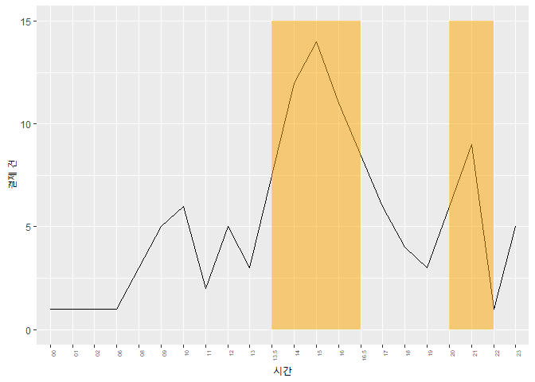
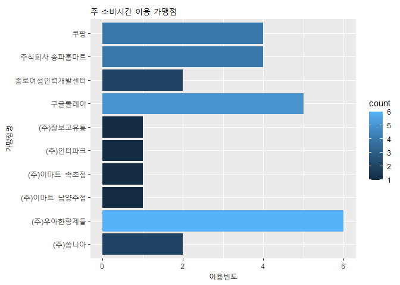
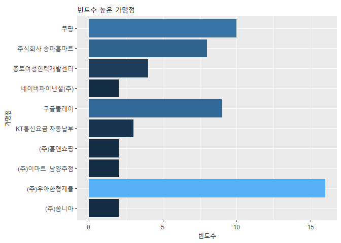
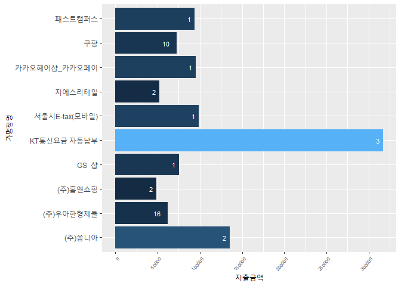

카드사용내역분석
================
주윤하
2020 9 21

## 카드 사용내역 분석

카드 새용내용을 분석해서 나의 주요 소비 패턴을 알아보고 불필요한 소비는 어떤 부분에서 발생하는지 분석해보도록 하갰습니다.

### 분석 순서

  - 신용카드 최근 3개월 자료를 로드, 형태 확인, 전처리
  - 빈도수가 높은 소비 시간대 확인
  - 빈도수가 높은 소비 항목 확인
  - 소비 금액이 높은 항목 확인
  - 불필요한 소비 내역 확인

#### 데이터 로드 및 형태확인, 전처리

``` r
month8 <- read_xls("0801.xls")
month7 <- read_xls("0701.xls")
month6 <- read_xls("0601.xls")

str(month8)
```

    ## tibble [21 x 9] (S3: tbl_df/tbl/data.frame)
    ##  $ 이용일시: chr [1:21] "2020/08/31  19:40" "2020/08/30  21:31" "2020/08/30  21:27" "2020/08/30  15:43" ...
    ##  $ 승인번호: chr [1:21] "08267800" "48210431" "48179050" "44927675" ...
    ##  $ 본인구분: chr [1:21] "본" "본" "본" "본" ...
    ##  $ 브랜드  : chr [1:21] "마스타" "마스타" "마스타" "마스타" ...
    ##  $ 이용카드: chr [1:21] "844" "844" "844" "844" ...
    ##  $ 가맹점명: chr [1:21] "지에스리테일" "구글플레이" "구글플레이" "구글플레이" ...
    ##  $ 이용금액: num [1:21] 51760 3900 3900 3900 19900 ...
    ##  $ 이용구분: chr [1:21] "일시불(A)" "일시불" "일시불" "일시불" ...
    ##  $ 매입상태: chr [1:21] "전표매입" "전표매입" "전표매입" "전표매입" ...

``` r
이용시간 <- substr(month8$이용일시, 13, 17)
month8 <- cbind(month8, 이용시간)

이용시간7 <- substr(month7$이용일시, 13, 17)
month7 <- cbind(month7, 이용시간7)
month7 <- rename(month7, 이용시간=이용시간7)

이용시간6 <- substr(month6$이용일시, 13, 17)
month6 <- cbind(month6, 이용시간6)
month6 <- rename(month6, 이용시간=이용시간6)
```

### 빈도수가 높은 시간대 분석

``` r
이용시간.t <- cbind(이용시간, 이용시간6, 이용시간7)
```

    ## Warning in cbind(이용시간, 이용시간6, 이용시간7): number of rows of result is
    ## not a multiple of vector length (arg 1)

``` r
이용시간.t <- table(unlist(이용시간.t))

이용시간.df <- as.data.frame(이용시간.t, stringAsFactor=F)
이용시간.df$Var1 <-substr(이용시간.df$Var1, 1, 2)
이용시간.df %>% group_by(Var1) %>% 
  summarise(sum=sum(Freq))->시간분석
```

    ## `summarise()` ungrouping output (override with `.groups` argument)

``` r
ggplot(data=시간분석, aes(x=Var1, y=sum, group=1))+
  geom_line()+ xlab('시간') + ylab('결제 건')+
  theme(axis.text.x=element_text(angle=90, hjust=1, size=5))->p

p+annotate("rect", xmin='13.5', xmax='16.5', ymin=0, ymax=15, alpha=0.5, fill="orange")+annotate("rect", xmin='20', xmax='22', ymin=0, ymax=15, alpha=0.5, fill="orange")
```

<!-- -->

그래프를 확인해보니 제 소비 패턴 중 ’시간’과 관련된 패턴이 있음을 알 수 있습니다. 보통 점심식사 이후, 저녁식사 이후 여가
시간에 주로 소비를 하고 있음을 알 수 있습니다.

### 빈도수가 높은 시간대 항목 분석

``` r
시간 <- rbind(month6, month7, month8)
시간 <- 시간 %>% select(가맹점명, 이용시간, 이용금액)
시간$이용시간 <- substr(시간$이용시간, 1, 2)

시간 %>% filter(이용시간 %in% c(13,14,15,16,20,21,22)) %>% 
  group_by(가맹점명) %>% summarise(count=n())-> hottime
```

    ## `summarise()` ungrouping output (override with `.groups` argument)

``` r
hottime <- hottime %>% 
  arrange(desc(count)) %>% 
  head(10)

ggplot(hottime, aes(x=가맹점명, y=count, fill=count))+geom_col()+
  coord_flip()+ylab('이용빈도')+ggtitle('주 소비시간 이용 가맹점')
```

<!-- -->

주 소비 시간대인 13시\~16시와 20시\~22시까지의 소비를 확인해보니 배달의 민족, 구글플레이, 쿠팡이 확인되었습니다.

### 빈도수가 높은 가맹점 분석

``` r
품목 <- cbind(month8$가맹점명, month7$가맹점명, month6$가맹점명)
```

    ## Warning in cbind(month8$가맹점명, month7$가맹점명, month6$가맹점명): number of
    ## rows of result is not a multiple of vector length (arg 1)

``` r
품목 <- table(unlist(품목))
품목.df <- as.data.frame(품목, stringAsFactor=F)
품목.10 <- 품목.df %>% arrange(desc(Freq)) %>% head(10)

ggplot(data=품목.10, aes(x=Var1, y=Freq, fill=Freq))+geom_col()+
  coord_flip()+ggtitle('빈도수 높은 가맹점')+xlab('가맹점')+ylab('빈도수')+
  theme(legend.position='none')
```

<!-- -->

3개월 동안 가장 많이 이용한 곳은 ‘우아한형제들’ 바로 배달의 민족 입니다. 그 다음은 쿠팡을 많이 이용했고 구글플레이, 마트
순서입니다. 1인 가구인 저는 쿠팡에서 생필품을 주로 구매하고 배달음식을 최근들어 자주 사먹었는데, 아마 다른 1인가구도
비슷한 소비 패턴을 보일 것으로 예상됩니다.

### 금액대가 높은 가맹점 분석

``` r
rm(금액)
```

    ## Warning in rm(금액): 객체 '금액'를 찾을 수 없습니다

``` r
rm(금액.t)
```

    ## Warning in rm(금액.t): 객체 '금액.t'를 찾을 수 없습니다

``` r
금액8 <- month8 %>% select(가맹점명, 이용금액)
금액7 <- month7 %>% select(가맹점명, 이용금액)
금액6 <- month6 %>% select(가맹점명, 이용금액)

금액8 <- 금액8 %>% group_by(가맹점명) %>% 
  summarise(mean=mean(이용금액))
```

    ## `summarise()` ungrouping output (override with `.groups` argument)

``` r
금액7 <- 금액7 %>% group_by(가맹점명) %>% 
  summarise(mean=mean(이용금액))
```

    ## `summarise()` ungrouping output (override with `.groups` argument)

``` r
금액6 <- 금액6 %>% group_by(가맹점명) %>% 
  summarise(mean=mean(이용금액))
```

    ## `summarise()` ungrouping output (override with `.groups` argument)

``` r
금액 <- merge(금액8, 금액7, by='가맹점명', all.x=T)
금액 <- merge(금액, 금액6, by='가맹점명', all=TRUE )
금액 <- rename(금액, "8월"=mean.x,
               '7월' = mean.y,
               '6월' = mean)

금액$'8월' <- ifelse(is.na(금액$'8월'), 0, 금액$'8월')
금액$'7월' <- ifelse(is.na(금액$'7월'), 0, 금액$'7월')
금액$'6월' <- ifelse(is.na(금액$'6월'), 0, 금액$'6월')

금액$'8월' <- as.numeric(금액$'8월')
금액$'7월' <- as.numeric(금액$'7월')
금액$'6월' <- as.numeric(금액$'6월')

(금액$'8월'+금액$'7월'+금액$'6월')->금액$합계

금액.t <- 금액 %>% 
  group_by(가맹점명) %>% 
  summarise(sum=sum(합계)) %>% 
  arrange(desc(sum))
```

    ## `summarise()` ungrouping output (override with `.groups` argument)

``` r
품목.df <- rename(품목.df, 가맹점명=Var1)

금액.품목 <- merge(금액.t, 품목.df, by='가맹점명', all.x=T)
금액.품목$sum <- round(금액.품목$sum,0)
금액.품목 %>% arrange(desc(sum)) %>% head(10)->top10
top10$평균 <- round(top10$sum/top10$Freq,0)


ggplot(data=top10, aes(x=가맹점명, y=sum, fill=sum))+
  geom_col()+
  coord_flip()+
  geom_text(aes(label=Freq), color='white', size=3, hjust=2)+
  scale_y_continuous(breaks=seq(0,400000, 50000))+
  theme(axis.text.x=element_text(angle=50, hjust=1, size=6), legend.position='none')+ylab('지출금액')
```

<!-- -->

### 불필요한 소비 내용 확인

그래프를 보면 가장 많은 지출이 있는 내역은 ‘통신비’입니다. 과연 저정도 상품이 필요한가 고민을 해봐야겠습니다. 그리고 금액이
높은건 ’쏨니아’ 쇼핑몰 내역입니다. 큰 지출이 나간 항목 중에서는 단발성 항목이거나 필수 항목인 경우가 많습니다.

주 소비 시간대와 겹치면서 이용 빈도가 타 가맹점에 비해 높은 쿠팡, 배달의 민족은 충동적인 소비도 있었을 것으로 예측됩니다.

하지만 빈도가 높은 쿠팡, 배달의 민족은 과연 정말 필요한 지출인지 고민해보고 구매를 하도록 노력해야겠습니다.
