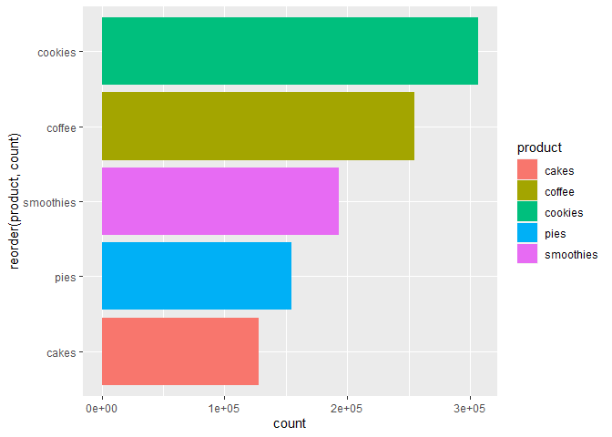

cafe 판매분석
================
주윤하
2020 8 21

\#카페 판매 분석

kaggle에서 카페 판매 분석이라는 데이터를 사용하여 간단한 분석을 해보려고 합니다. 판매 품목별 판매량과 프로모션 여부가 있는
데이터로 먼저 판매 인기 품목을 확인하고 프로모션이 판매가 주는 영향이 얼마나 있는지 분석해보도록 하겠습니다.

### 사용할 데이터 로드

``` r
bakery<- read.csv("bakery_sales.csv")
tibble(bakery)
```

    ## # A tibble: 5,113 x 9
    ##        X Date       weekday   cakes  pies cookies smoothies coffee promotion
    ##    <int> <chr>      <chr>     <int> <int>   <int>     <int>  <int> <chr>    
    ##  1     0 2006-01-01 Sunday       45    41      50        19     73 promotion
    ##  2     1 2006-01-02 Monday       48    18      18        44      5 none     
    ##  3     2 2006-01-03 Tuesday       1    40      99        41      8 none     
    ##  4     3 2006-01-04 Wednesday     4    10      15        58     95 none     
    ##  5     4 2006-01-05 Thursday      4    44      67        71     20 promotion
    ##  6     5 2006-01-06 Friday       40    27     104        39     76 promotion
    ##  7     6 2006-01-07 Saturday     10    21      10        26      5 none     
    ##  8     7 2006-01-08 Sunday       20    58      59        74     68 promotion
    ##  9     8 2006-01-09 Monday       22     5      28        61     54 none     
    ## 10     9 2006-01-10 Tuesday      37    43      76        72     67 promotion
    ## # ... with 5,103 more rows

### 1\. 품목별 판매 빈도 분석

해당 데이터에 있는 판매 품목은 베이커리, 케이크, 스무디, 파이, 쿠키, 커피로 총 5가지이며 이 중 판매 수량이 높은 것이
무엇인지 분석해보도록 하겠습니다.

``` r
sale <- bakery %>% 
  pivot_longer(c(`pies`,`cakes`,`coffee`,`smoothies`,`cookies`),names_to="product", values_to="count") %>% 
  group_by(product)

ggplot(data=sale, aes(x=reorder(product, count), y=count, fill=product)) +
  geom_col() + coord_flip()
```

<!-- -->

그래프를 확인해보면, 이 카페에서 가장 많이 팔리는 품목은 쿠키이며 그 다음으로 커피가 많이 판매되는 것을 알 수 있습니다.
그렇다면 프로모션의 진행여부에 따라 총 판매량과 판매 품목의 순위가 달라지는지 확인해보도록 하겠습니다.

### 2\. 프로모션 여부에 따른 총 판매량

``` r
promotion1 <- sale %>% 
  group_by(promotion) %>% 
  summarise(sum_count=sum(count))
```

    ## `summarise()` ungrouping output (override with `.groups` argument)

``` r
table(promotion1)
```

    ##            sum_count
    ## promotion   384871 652032
    ##   none           1      0
    ##   promotion      0      1

``` r
ggplot()+
  geom_col(promotion1, mapping=aes(x=promotion, y=sum_count, fill=promotion))
```

<!-- -->

먼저 프로모션 진행 여부에 따른 총 판매량을 비교했을때, 프로모션을 진행하는 경우 약 1.6배 판매가 많은 것을 알 수 있습니다.

### 2-1. 프로모션에 따른 품목별 판매량 비교

``` r
promotion <- sale %>% 
  filter(promotion=="promotion") %>% 
  group_by(product)

ggplot(data=promotion, mapping=aes(x=reorder(product, count), y=count, fill=product)) +
  geom_col()+coord_flip()+
  ggtitle("프로모션 진행")
```

<!-- -->

``` r
none <- sale %>% 
  filter(promotion=="none") %>% 
  group_by(product)

ggplot() + 
  geom_col(none, mapping=aes(x=reorder(product, count), y=count, fill=product)) +
  coord_flip()+ ggtitle("프로모션 진행x")
```

<!-- -->

그래프를 보면 총 판매량 외에 품목에는 큰 차이가 없는 것을 알 수 있습니다.

### 3\. 요일에 따른 판매량의 변화

``` r
weekday <- sale %>% 
  group_by(weekday)

ggplot() +
  geom_col(weekday, mapping=aes(x=weekday, y=count, fill=product))+coord_flip()
```

<!-- -->

요일별 분석 그래프를 확인해보면 해당 카페는 요일별 판매량도 큰 변동이 없으며, 요일별 판매 품목의 수량도 큰 변동이 없는 것을
확인할 수 있습니다.

### 결론.

해당 카페의 인기메뉴는 쿠키와 커피이며, 프로모션을 진행한 경우 전반적인 품목의 판매가 증가하여 총 판매량은 1.6배 정도 증가한
것을 알 수 있습니다.
