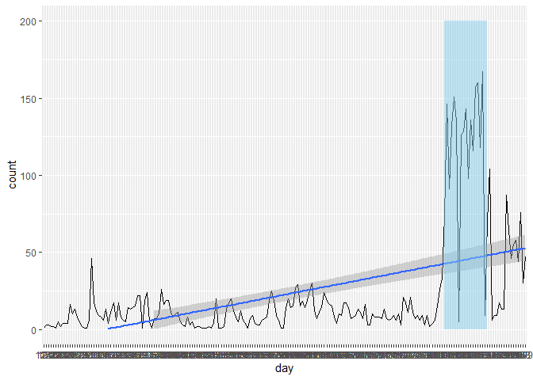
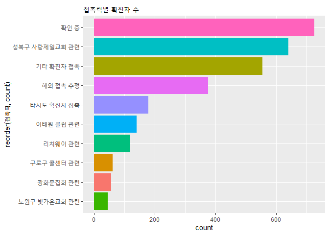
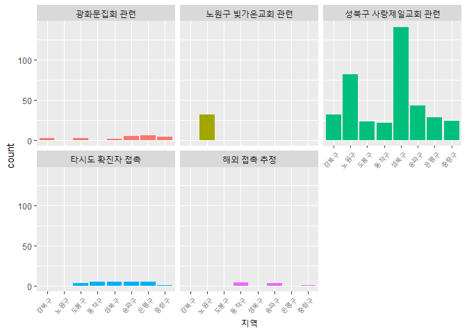

코로나분석\_0813자료
================
주윤하
2020 9 11

## 코로나 8월 13일 자료분석

2020년도 2월부터 퍼지기 시작한 코로나 바이러스가 현재까지 기승을 부리고 있어 9월에는 거리두기 2.5단계를 시행하게
되었습니다. 코로나 바이러스의 가장 최근 버전 데이터인 8월 13일 데이터를 사용하여 서울지역 전파에서 가장 큰
요인은 무엇이고 어떤 지역의 확진자 수가 많은지 분석해보도록 하겠습니다.

### 분석벙법

  - 사용데이터 로드 및 전처리
  - 분석에 사용할 변수 조합
  - 전처리 데이터 시각화
  - 시각화 자료를 바탕으로 분석

### 1\. 데이터 로드 및 전처리

``` r
corona <- read.csv("서울시 코로나19 확진자 현황.csv")
glimpse(corona)
```

    ## Rows: 4,526
    ## Columns: 14
    ## $ 연번     <int> 4526, 4525, 4524, 4523, 4522, 4521, 4520, 4519, 4518, 4517, ...
    ## $ 확진일   <chr> "9.09.", "9.09.", "9.09.", "9.09.", "9.09.", "9.09.", "9.09."...
    ## $ 환자번호 <chr> "21737", "21719", "21709", "21704", "21702", "21611", "21708",...
    ## $ 국적     <lgl> NA, NA, NA, NA, NA, NA, NA, NA, NA, NA, NA, NA, NA, NA, NA, ...
    ## $ 환자정보 <lgl> NA, NA, NA, NA, NA, NA, NA, NA, NA, NA, NA, NA, NA, NA, NA, NA...
    ## $ 지역     <chr> "은평구", "타시도", "강동구", "은평구", "강동구", "용산구", "관악구", "도봉구", "도봉구...
    ## $ 여행력   <chr> "", "", "", "", "", "", "", "", "", "", "", "", "", "", "", "...
    ## $ 접촉력   <chr> "서대문구 세브란스 병원", "타시도 확진자 접촉", "강동구 BF모바일 콜센터", "기타 확진자 접촉", "...
    ## $ 조치사항 <lgl> NA, NA, NA, NA, NA, NA, NA, NA, NA, NA, NA, NA, NA, NA, NA, NA...
    ## $ 상태     <chr> "", "", "", "", "", "", "", "", "", "", "", "", "", "", "", ...
    ## $ 이동경로 <chr> "", "확인 중", "확인 중", "", "확인 중", "", "확인 중", "확인 중", "확인 중", ""...
    ## $ 등록일   <chr> "2020-09-10 10:57", "2020-09-10 10:57", "2020-09-10 10:57", "...
    ## $ 수정일   <chr> "2020-09-11 9:34", "2020-09-10 10:57", "2020-09-10 10:57", "2...
    ## $ 노출여부 <chr> "Y", "Y", "Y", "Y", "Y", "Y", "Y", "Y", "Y", "Y", "Y", "Y", "Y...

``` r
corona %>% 
  group_by(확진일) %>% 
  summarise(count=n())->day
```

    ## `summarise()` ungrouping output (override with `.groups` argument)

``` r
day<- arrange(day, desc(count))
day<- rename(day,
             day=확진일)

day$count<- as.numeric(day$count)
class(day$count)
```

    ## [1] "numeric"

``` r
str_replace_all(day$day,"[.-.]","")->day$day
```

### 2\. 데이터 시각화

``` r
ggplot(day, aes(x=day, y=count, group=1))+
  geom_line(colour='black')+geom_smooth(method='lm')+ylim(0,200)->p
p+
  annotate("rect", xmin='814', xmax='830', ymin=0, ymax=200, alpha=0.5, fill="skyblue")
```

    ## `geom_smooth()` using formula 'y ~ x'

    ## Warning: Removed 27 rows containing missing values (geom_smooth).

<!-- -->

시계열 그래프를 확인한 결과 8월에 가장 두드러지게 확진자가 증가했음을 알 수 있습니다. 그렇다면 8월을 기준으로 어떤 지역에서
어떤 요인으로 바이러스 확산이 증폭되었는지 확인해보도록 하겠습니다.

### 3\. 지역, 접촉력 변수 추출 및 전처리

``` r
corona$month <- str_replace_all(corona$확진일,"[.-.]","")
corona$month <- as.numeric(corona$month)
corona$month <- round(corona$month/100)
corona$month <- as.character(corona$month)
corona$month <- paste0(corona$month, '월')

region <- corona %>% 
  group_by(지역) %>% 
  select(지역, 접촉력, month)
```

지역과 접촉력의 경우 여러가지 값이 있지만, 유의미한 데이터만 추리기 위해 arrange를 사용하여 상위10개만 추출 후
분석하도록 하겠습니다.

``` r
region %>% group_by(접촉력) %>% 
  summarise(count=n()) %>% 
  arrange(desc(count)) %>% 
  head(10)->region_c
```

    ## `summarise()` ungrouping output (override with `.groups` argument)

``` r
region %>% 
  filter(month=='8월')->region_m

region_m <- region_m %>% 
  filter(접촉력 %in% c('확인중','성북구 사랑제일교회 관련','기타, 확진자 접촉','해외 접촉 추정','타시도 확진자 접촉','이태원 클럽 관련','리치웨이 관련','구로구 콜센터 관련','광화문집회 관련','노원구 빛가온교회 관련')) %>% 
  filter(지역 %in% c('성북구','노원구','송파구','은평구','강북구','동작구','중랑구','관역구','도봉구'))
```

### 4\. 전처리 데이터 시각화

  - 접촉력 별 확진자수

<!-- end list -->

``` r
ggplot(region_c, aes(x=reorder(접촉력,count), y=count, fill=접촉력))+geom_col()+coord_flip()+
  theme(legend.position="none")+ggtitle("접촉력별 확진자 수")
```

<!-- -->

위 그래프를 확인해보면 성북구 사랑제일교회 발 코로나 바이러스로 인한 확진자 증가가 가장 많음을 알 수 있습니다.

  - 지역별, 접촉력별 확진자수

<!-- end list -->

``` r
ggplot(region_m, aes(x=지역, fill=접촉력))+geom_bar()+
  facet_wrap(~접촉력, nrow=2)+theme(legend.position = "none")+
  theme(axis.text.x = element_text(angle=50, hjust=1, size=7))
```

<!-- -->

접촉력별, 지역별 확진자 수를 확인해보니 성북구 사랑제일교회가 8월 코로나바이러스 확산에 가장 큰 영향을 끼쳤으며, 해당 요인으로
인한 감염자는 성북구가 가장 많음을 알 수 있습니다.
