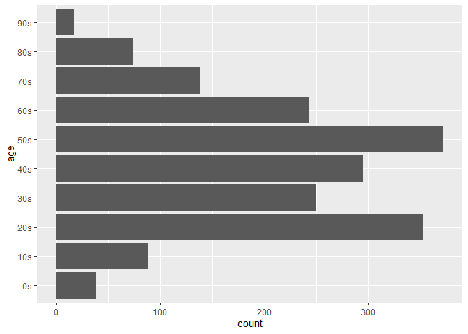

코로나환자분석
================
주윤하
2020 8 16

# 코로나 환자 분석

전 세게적으로 번진 코로나 바이러스의 데이터 중 환자 데이터를 사용하여 코로나가 어떤 특징을 갖는 바이러스인지 검토해보도록
하겠습니다.

## 분석방법

  - 사용할 데이터를 로드하고 전처리합니다.
  - 전처리 한 데이터를 사용하여 분석표를 작성합니다.
  - 분석표를 기준으로 그래프를 작성하고 분석합니다.

### 1\. 사용할 데이터 로드

환자의 기록에 관련된 자료는 info와 route로 두가지 이며, 해당 두 자료는 분석을 편리하게 하기 위해서
patient\_id 기준으로 결합하도록 하겠습니다.

``` r
tibble(patient_info)
```

    ## # A tibble: 4,004 x 18
    ##    patient_id global_num sex   birth_year age   country province city  disease
    ##         <dbl>      <dbl> <chr>      <dbl> <chr> <chr>   <chr>    <chr> <lgl>  
    ##  1 1000000001          2 male        1964 50s   Korea   Seoul    Gang~ NA     
    ##  2 1000000002          5 male        1987 30s   Korea   Seoul    Jung~ NA     
    ##  3 1000000003          6 male        1964 50s   Korea   Seoul    Jong~ NA     
    ##  4 1000000004          7 male        1991 20s   Korea   Seoul    Mapo~ NA     
    ##  5 1000000005          9 fema~       1992 20s   Korea   Seoul    Seon~ NA     
    ##  6 1000000006         10 fema~       1966 50s   Korea   Seoul    Jong~ NA     
    ##  7 1000000007         11 male        1995 20s   Korea   Seoul    Jong~ NA     
    ##  8 1000000008         13 male        1992 20s   Korea   Seoul    etc   NA     
    ##  9 1000000009         19 male        1983 30s   Korea   Seoul    Song~ NA     
    ## 10 1000000010         21 fema~       1960 60s   Korea   Seoul    Seon~ NA     
    ## # ... with 3,994 more rows, and 9 more variables: infection_case <chr>,
    ## #   infection_order <dbl>, infected_by <dbl>, contact_number <dbl>,
    ## #   symptom_onset_date <date>, confirmed_date <date>, released_date <date>,
    ## #   deceased_date <lgl>, state <chr>

``` r
tibble(patient_route)
```

    ## # A tibble: 8,092 x 8
    ##    patient_id global_num date       province  city    type    latitude longitude
    ##         <dbl>      <dbl> <date>     <chr>     <chr>   <chr>      <dbl>     <dbl>
    ##  1 1000000001          2 2020-01-22 Gyeonggi~ Gimpo-~ airport     37.6      127.
    ##  2 1000000001          2 2020-01-24 Seoul     Jung-gu hospit~     37.6      127.
    ##  3 1000000002          5 2020-01-25 Seoul     Seongb~ etc         37.6      127.
    ##  4 1000000002          5 2020-01-26 Seoul     Seongb~ store       37.6      127.
    ##  5 1000000002          5 2020-01-26 Seoul     Seongd~ public~     37.6      127.
    ##  6 1000000002          5 2020-01-26 Seoul     Seongb~ public~     37.6      127.
    ##  7 1000000002          5 2020-01-26 Seoul     Seongb~ store       37.6      127.
    ##  8 1000000002          5 2020-01-27 Seoul     Seongb~ restau~     37.6      127.
    ##  9 1000000002          5 2020-01-27 Seoul     Dongda~ store       37.6      127.
    ## 10 1000000002          5 2020-01-28 Seoul     Seongb~ etc         37.6      127.
    ## # ... with 8,082 more rows

``` r
head(patient_info)
```

    ## # A tibble: 6 x 18
    ##   patient_id global_num sex   birth_year age   country province city  disease
    ##        <dbl>      <dbl> <chr>      <dbl> <chr> <chr>   <chr>    <chr> <lgl>  
    ## 1 1000000001          2 male        1964 50s   Korea   Seoul    Gang~ NA     
    ## 2 1000000002          5 male        1987 30s   Korea   Seoul    Jung~ NA     
    ## 3 1000000003          6 male        1964 50s   Korea   Seoul    Jong~ NA     
    ## 4 1000000004          7 male        1991 20s   Korea   Seoul    Mapo~ NA     
    ## 5 1000000005          9 fema~       1992 20s   Korea   Seoul    Seon~ NA     
    ## 6 1000000006         10 fema~       1966 50s   Korea   Seoul    Jong~ NA     
    ## # ... with 9 more variables: infection_case <chr>, infection_order <dbl>,
    ## #   infected_by <dbl>, contact_number <dbl>, symptom_onset_date <date>,
    ## #   confirmed_date <date>, released_date <date>, deceased_date <lgl>,
    ## #   state <chr>

``` r
head(patient_route)
```

    ## # A tibble: 6 x 8
    ##   patient_id global_num date       province  city    type     latitude longitude
    ##        <dbl>      <dbl> <date>     <chr>     <chr>   <chr>       <dbl>     <dbl>
    ## 1 1000000001          2 2020-01-22 Gyeonggi~ Gimpo-~ airport      37.6      127.
    ## 2 1000000001          2 2020-01-24 Seoul     Jung-gu hospital     37.6      127.
    ## 3 1000000002          5 2020-01-25 Seoul     Seongb~ etc          37.6      127.
    ## 4 1000000002          5 2020-01-26 Seoul     Seongb~ store        37.6      127.
    ## 5 1000000002          5 2020-01-26 Seoul     Seongd~ public_~     37.6      127.
    ## 6 1000000002          5 2020-01-26 Seoul     Seongb~ public_~     37.6      127.

``` r
View(patient_route)


patient_info %>%left_join(patient_route, by="patient_id")
```

    ## # A tibble: 10,624 x 25
    ##    patient_id global_num.x sex   birth_year age   country province.x city.x
    ##         <dbl>        <dbl> <chr>      <dbl> <chr> <chr>   <chr>      <chr> 
    ##  1 1000000001            2 male        1964 50s   Korea   Seoul      Gangs~
    ##  2 1000000001            2 male        1964 50s   Korea   Seoul      Gangs~
    ##  3 1000000002            5 male        1987 30s   Korea   Seoul      Jungn~
    ##  4 1000000002            5 male        1987 30s   Korea   Seoul      Jungn~
    ##  5 1000000002            5 male        1987 30s   Korea   Seoul      Jungn~
    ##  6 1000000002            5 male        1987 30s   Korea   Seoul      Jungn~
    ##  7 1000000002            5 male        1987 30s   Korea   Seoul      Jungn~
    ##  8 1000000002            5 male        1987 30s   Korea   Seoul      Jungn~
    ##  9 1000000002            5 male        1987 30s   Korea   Seoul      Jungn~
    ## 10 1000000002            5 male        1987 30s   Korea   Seoul      Jungn~
    ## # ... with 10,614 more rows, and 17 more variables: disease <lgl>,
    ## #   infection_case <chr>, infection_order <dbl>, infected_by <dbl>,
    ## #   contact_number <dbl>, symptom_onset_date <date>, confirmed_date <date>,
    ## #   released_date <date>, deceased_date <lgl>, state <chr>, global_num.y <dbl>,
    ## #   date <date>, province.y <chr>, city.y <chr>, type <chr>, latitude <dbl>,
    ## #   longitude <dbl>

``` r
head(patient_info)
```

    ## # A tibble: 6 x 18
    ##   patient_id global_num sex   birth_year age   country province city  disease
    ##        <dbl>      <dbl> <chr>      <dbl> <chr> <chr>   <chr>    <chr> <lgl>  
    ## 1 1000000001          2 male        1964 50s   Korea   Seoul    Gang~ NA     
    ## 2 1000000002          5 male        1987 30s   Korea   Seoul    Jung~ NA     
    ## 3 1000000003          6 male        1964 50s   Korea   Seoul    Jong~ NA     
    ## 4 1000000004          7 male        1991 20s   Korea   Seoul    Mapo~ NA     
    ## 5 1000000005          9 fema~       1992 20s   Korea   Seoul    Seon~ NA     
    ## 6 1000000006         10 fema~       1966 50s   Korea   Seoul    Jong~ NA     
    ## # ... with 9 more variables: infection_case <chr>, infection_order <dbl>,
    ## #   infected_by <dbl>, contact_number <dbl>, symptom_onset_date <date>,
    ## #   confirmed_date <date>, released_date <date>, deceased_date <lgl>,
    ## #   state <chr>

### 2\. 사용할 데이터 전처리

사용할 데이터들의 구조나 변수, 값 등을 확인하고 어떤식으로 사용하면 좋을지 이름변경, 형태 변경등의 가공을 진행합니다.

사용 할 데이터는 감염 사례, 접촉자 수, 연령 총 3가지를 사용하도록 하겠습니다.

### 2\_1. 연령별 감염 사례.

먼저 어떤 연령에서 감염자가 가장 많은지 확인하고 주요 감염 요인이 무엇인지 확인해보도록 하겠습니다.

#### 연령별 감염자 수 \_그래프

``` r
table(is.na(patient_info$age))
```

    ## 
    ## FALSE  TRUE 
    ##  3525   479

``` r
infection_rank <- patient_info %>% 
  group_by(infection_case) %>% 
  summarise(n=n())
```

    ## `summarise()` ungrouping output (override with `.groups` argument)

``` r
age_infaction <- patient_info %>% 
  select(age, infection_case)%>% 
  filter(!is.na(age) & !is.na(infection_case)) %>% 
  filter(infection_case %in% c("contact with patient", "etc", "overseas flow","Shincheonji Church", "Guro-gu Call Center", "Itaewon Clubs")) %>% 
  group_by(infection_case)

ggplot(age_infaction, aes(x=age)) + geom_bar() + coord_flip()
```

<!-- -->

그래프를 확인해보면 50대에서 확진자가 가장 많았으며, 그 다음으로 20대, 40대 순으로 많았습니다. 그렇다면 감염 요인이
어떤지 나이, 감염요인 2가지 변수로 그래프를 그려 분석해보도록 하겠습니다.

### 3\. 나이, 감염요인 그래프

``` r
ggplot(age_infaction, aes(x=infection_case)) + 
  geom_bar(mapping=aes(fill=age))+coord_flip() + 
  facet_wrap(~age, nrow=3)
```

<!-- -->

전체 연령에서 가장 많은 비중을 차지한 감염 요인인 ‘감염자와의 접촉’ 이었습니다. 감염자가 가장 많았던 50대에서 감염자와의
접촉 다음으로 높은 것은 ’기타 요인’으로 어떤 요인에 의한 감염인지 알 수 없습니다.

20대에서 감염자와의 접촉 다음으로 높은 요인은 50대와 동일하게 기타 요인이며, 눈에 띄는 부분은 ’신천지 교회 집단감염’의
비율이 20대가 가장 높다는 점 입니다. 이 분석으로 볼 때, 신천지 신도 중 20대의 비중이 높다는 것도 추측해 볼 수
있습니다.

1)  감염 사례와 접촉사 수의 관계를 통해 가장 위험성이 큰 감염 사례가 어떤 것이 었는지 확인해보도록 하겠습니다.

### 4\. 1차 결론

나이, 감염요인을 비교한 결과 가장 높은 감염 요인은 환자와의 접촉이었습니다. 언론에서 신천지, 구로 콜센터 등 집단 감염 사례예
대한 보도가 많아 해당 사례가 압도적으로 높을 것으로 예상했으나 결과는 달랐습니다.

그렇다면 50대와 20대가 확진자와 더 많이 접촉한 사유가 무엇인지 분석해보도록 하겠습니다.

### 5\. 나이대별 유동인구

``` r
age_floating <- seoul_floating %>% 
  group_by(birth_year) %>% 
  summarise(mean_fp = mean(fp_num))
```

    ## `summarise()` ungrouping output (override with `.groups` argument)

``` r
ggplot(age_floating, aes(x=birth_year, y=mean_fp)) + geom_col() 
```

<!-- -->

해당 그래프에서 보면, 유동 인구의 수가 많은 연령대는 30, 40대임을 알 수 있습니다. 따라서 환자와의 접촉으로 인한 확진이
많은 20대와 50대는 유동인구의 비율이 낮은 편은 아니지만, 30대와 40대에 비해 감염확률이 높은 루트로 이동이 많았음을
추측해 볼 수 있습니다.

### 6\. 결론

확진의 가장 큰 요인은 ’환자와의 접촉’이며, 유동인구의 수와 확진자의 수는 양의 관계이긴 하지만 주요 요인으로 보기는
어렵습니다.

따라서 코로나를 예방하기 위해서는 사람들이 많은 장소 방문 자제 뿐만 아니라 타인과의 거리두기를 통해서 확진자와의 접촉을 보다
줄일 수 있도록 주의가 필요합니다.
