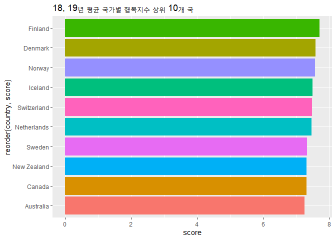
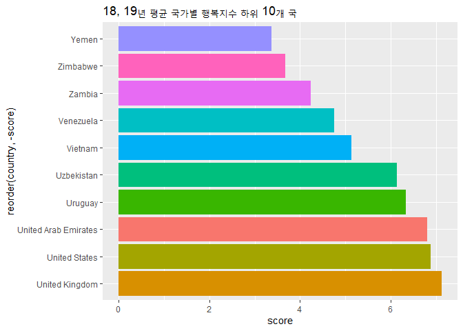
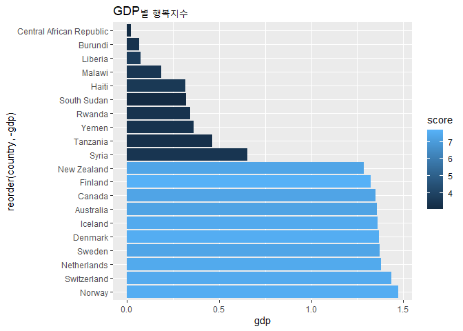
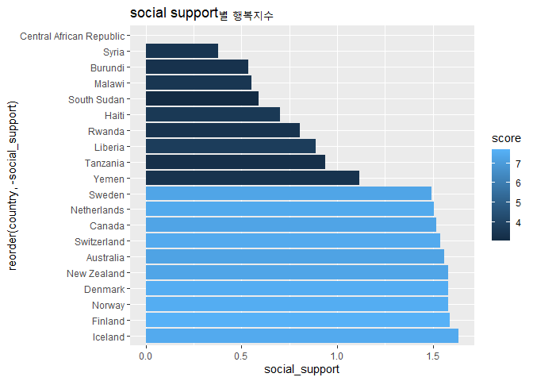
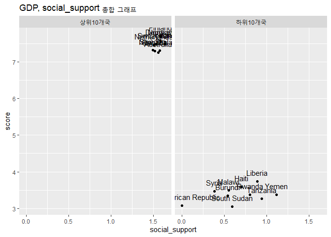

행복지수 분석
================
주윤하
August 31, 2020

## 행복지수 분석

나라별 행복지수를 측정한 데이터를 사용하여 행복지수에 영향을 주는 요인이 무엇인지 분석해보도록 하겠습니다.

### 데이터 로드

``` r
happy18 <- read.csv("2018.csv")
happy19 <- read.csv("2019.csv")
```

``` r
glimpse(happy18)
```

    ## Rows: 156
    ## Columns: 9
    ## $ Overall.rank                 <int> 1, 2, 3, 4, 5, 6, 7, 8, 9, 10, 11, 12,...
    ## $ Country.or.region            <chr> "Finland", "Norway", "Denmark", "Icela...
    ## $ Score                        <dbl> 7.632, 7.594, 7.555, 7.495, 7.487, 7.4...
    ## $ GDP.per.capita               <dbl> 1.305, 1.456, 1.351, 1.343, 1.420, 1.3...
    ## $ Social.support               <dbl> 1.592, 1.582, 1.590, 1.644, 1.549, 1.4...
    ## $ Healthy.life.expectancy      <dbl> 0.874, 0.861, 0.868, 0.914, 0.927, 0.8...
    ## $ Freedom.to.make.life.choices <dbl> 0.681, 0.686, 0.683, 0.677, 0.660, 0.6...
    ## $ Generosity                   <dbl> 0.202, 0.286, 0.284, 0.353, 0.256, 0.3...
    ## $ Perceptions.of.corruption    <chr> "0.393", "0.340", "0.408", "0.138", "0...

### 행복지수가 가장 높은나라 연도별로 추출

``` r
rank18 <- happy18 %>% 
  select(Country.or.region, Score, GDP.per.capita, Social.support)
rank19 <- happy19 %>% 
  select(Country.or.region, Score, GDP.per.capita, Social.support)


rank0 <- left_join(rank18, rank19, by="Country.or.region")
head(rank)
```

    ##                                                                    
    ## 1 function (x, na.last = TRUE, ties.method = c("average", "first", 
    ## 2     "last", "random", "max", "min"))                             
    ## 3 {                                                                
    ## 4     nas <- is.na(x)                                              
    ## 5     nm <- names(x)                                               
    ## 6     ties.method <- match.arg(ties.method)

``` r
rank0 <- rename(rank0, 
               score18=Score.x,
               score19=Score.y,
               gdp18=GDP.per.capita.x,
               gdp19=GDP.per.capita.y,
               social_support18=Social.support.x,
               social_support19=Social.support.y,
               country = Country.or.region
               )
```

### 나라별 행복지수 비교

``` r
rank <- rank0 %>% 
  group_by(country) %>% 
  summarise(score = (score18 + score19)/2)
```

    ## `summarise()` ungrouping output (override with `.groups` argument)

``` r
rank1 <- rank %>% arrange(desc(score)) %>% 
  head(10)

rank2 <-rank %>% tail(10)
  

ggplot(data=rank1, aes(x=reorder(country, score), y=score, fill=country))+geom_col()+
  coord_flip() + ggtitle("18, 19년 평균 국가별 행복지수 상위 10개 국")+
  theme(legend.position="none")
```

<!-- -->

``` r
ggplot(data=rank2, aes(x=reorder(country, -score), y=score, fill=country))+geom_col()+
  coord_flip() + ggtitle("18, 19년 평균 국가별 행복지수 하위 10개 국")+
  theme(legend.position="none")
```

<!-- -->

``` r
rank_ht <- rank0 %>% head(10)
rank_ht <- rbind(rank_ht, rank0 %>% tail(10))
rank_ht <- rank_ht %>% 
  mutate(score=(score18+score19)/2) %>% 
  mutate(gdp=(gdp18+gdp19)/2) %>% 
  mutate(social_support=(social_support18+social_support19)/2)

rank_ht$grade <- ifelse(rank_ht$gdp >=1, "상위10개국","하위10개국")
  
  rank_ht <- rank_ht %>% 
  group_by(country)

ggplot(data=rank_ht, aes(x=reorder(country, -gdp), y=gdp, fill=score))+geom_col()+
  coord_flip()+ggtitle("GDP별 행복지수")
```

<!-- -->

GDP별 행복지수 그래프를 보면, GDP가 높은 나라들의 행복지수가 높다는 것을 알 수 있습니다. GDP 하위 10개국 중에서도
값의 차이가 있지만 행복지수가 높지 않은 것을 볼 때 GDP가 어느 정도 수준 이상 높아야 행복지수가 높다는 것을 예측해 볼
수 있습니다.

``` r
ggplot(data=rank_ht, aes(x=reorder(country, -social_support), y=social_support, fill=score))+geom_col()+
  coord_flip()+ggtitle("social support별 행복지수")
```

<!-- -->

social support별 행복지수를 확인해보면 앞서 본 GDP보다는 행복지수와의 관계가 명확하지 않습니다. GDP 하위
국가들의 사회적 지원 정도의 차이가 크기 때문에 해당 요인 외에 다른 중요한 요인이 있을 수 있다고 예측할 수
있습니다.

``` r
ggplot(data=rank_ht, aes(x=social_support, y=score))+
  geom_point()+geom_text(mapping = aes(label = country),
            size = 4, 
            vjust = -1,
            family = 'NanumGothic') + facet_grid(~grade)+
  ggtitle("GDP, social_support 총합 그래프")
```

    ## Warning in grid.Call.graphics(C_text, as.graphicsAnnot(x$label), x$x, x$y, : 윈
    ## 도우즈 폰트데이터베이스에서 찾을 수 없는 폰트페밀리입니다

<!-- -->

위 그래프 중 GDP가 높은 국가를 보면 사회적인 보장과 행복지수과 양의 관계를 갖는 것을 알 수 있습니다. 반대로 GDP가 낮은
국가를 보면, 사회적인 보장이 매우 낮지는 않지만 행복지수가 낮는 국가들이 있는 것을 확인할 수 있습니다.

따라서 GDP와 행복지수 사이의 관계는 정비래 관계이지만 사회적 지지, 보장은 확실한 양의 관계라고 볼 수 없습니다.
