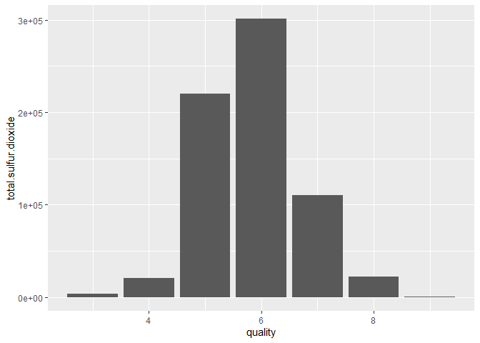
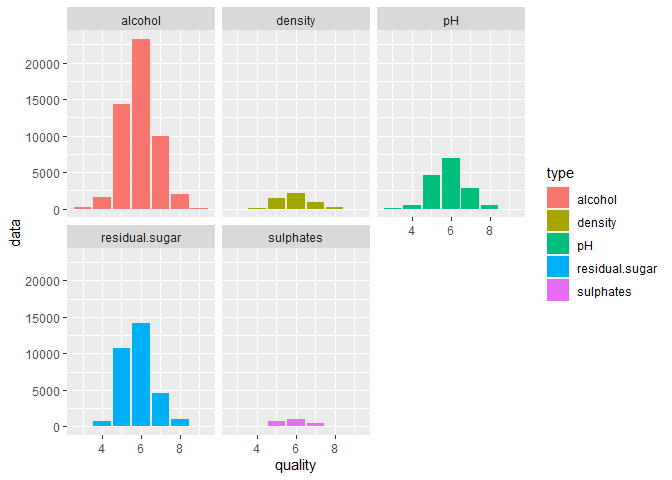

화이트와인 분석
================
주윤하
August 16.2020

# 화이트와인 분석

## 분석방법

  - 데이터를 로드
  - 로드한 데이터를 전처리
  - 전처리한 데이터 시각화
  - 그래프 분석, 결론 도출

#### 1\. 사용할 데이터를 로드합니다.

``` r
w.wine <- read.csv("winequality-white.csv")
```

#### 2\. 로드한 데이터를 전처리합니다.

그래프에서 면분할하여 분석할 변수들을 pivot\_longer를 사용하여 type이라는 변수에 값을 넣어줍니다.

``` r
head(w.wine)
```

    ##   fixed.acidity volatile.acidity citric.acid residual.sugar chlorides
    ## 1           7.0             0.27        0.36           20.7     0.045
    ## 2           6.3             0.30        0.34            1.6     0.049
    ## 3           8.1             0.28        0.40            6.9     0.050
    ## 4           7.2             0.23        0.32            8.5     0.058
    ## 5           7.2             0.23        0.32            8.5     0.058
    ## 6           8.1             0.28        0.40            6.9     0.050
    ##   free.sulfur.dioxide total.sulfur.dioxide density   pH sulphates alcohol
    ## 1                  45                  170  1.0010 3.00      0.45     8.8
    ## 2                  14                  132  0.9940 3.30      0.49     9.5
    ## 3                  30                   97  0.9951 3.26      0.44    10.1
    ## 4                  47                  186  0.9956 3.19      0.40     9.9
    ## 5                  47                  186  0.9956 3.19      0.40     9.9
    ## 6                  30                   97  0.9951 3.26      0.44    10.1
    ##   quality
    ## 1       6
    ## 2       6
    ## 3       6
    ## 4       6
    ## 5       6
    ## 6       6

``` r
glimpse(w.wine)
```

    ## Rows: 4,898
    ## Columns: 12
    ## $ fixed.acidity        <dbl> 7.0, 6.3, 8.1, 7.2, 7.2, 8.1, 6.2, 7.0, 6.3, 8...
    ## $ volatile.acidity     <dbl> 0.27, 0.30, 0.28, 0.23, 0.23, 0.28, 0.32, 0.27...
    ## $ citric.acid          <dbl> 0.36, 0.34, 0.40, 0.32, 0.32, 0.40, 0.16, 0.36...
    ## $ residual.sugar       <dbl> 20.70, 1.60, 6.90, 8.50, 8.50, 6.90, 7.00, 20....
    ## $ chlorides            <dbl> 0.045, 0.049, 0.050, 0.058, 0.058, 0.050, 0.04...
    ## $ free.sulfur.dioxide  <dbl> 45, 14, 30, 47, 47, 30, 30, 45, 14, 28, 11, 17...
    ## $ total.sulfur.dioxide <dbl> 170, 132, 97, 186, 186, 97, 136, 170, 132, 129...
    ## $ density              <dbl> 1.0010, 0.9940, 0.9951, 0.9956, 0.9956, 0.9951...
    ## $ pH                   <dbl> 3.00, 3.30, 3.26, 3.19, 3.19, 3.26, 3.18, 3.00...
    ## $ sulphates            <dbl> 0.45, 0.49, 0.44, 0.40, 0.40, 0.44, 0.47, 0.45...
    ## $ alcohol              <dbl> 8.8, 9.5, 10.1, 9.9, 9.9, 10.1, 9.6, 8.8, 9.5,...
    ## $ quality              <int> 6, 6, 6, 6, 6, 6, 6, 6, 6, 6, 5, 5, 5, 7, 5, 7...

``` r
quality_wine<-w.wine %>% 
  pivot_longer(c(`pH`, `alcohol`, `density`, `sulphates`, `residual.sugar`), names_to="type", values_to="data")
```

#### 3\. 전처리한 데이터를 사용하여 그래프를 그립니다.

total.sulfur.dioxdie는 값의 범위가 다르기 때문에 구분하여 분석하도록 하겠습니다. facet\_wrap를 사용하여
type별로 그래프를 면분할하여 분석합니다.

``` r
sulfur.dioxide <- w.wine %>% 
  select(total.sulfur.dioxide, quality) %>% 
  group_by(quality)

ggplot(sulfur.dioxide, aes(x=quality, y=total.sulfur.dioxide))+
         geom_col()
```

<!-- -->

``` r
ggplot(quality_wine, aes(x=quality, y=data, fill=type))+geom_col()+
  facet_wrap(~type, nrow=2)
```

<!-- -->

#### 4\. 결론

레드와인과 마찬가지로 quality에 영향을 미치는 요인으로 정비례 관계를 나타내는 변수는 없는 것으로 확인되었습니다.
alchol과 sulfur.dioxdie는 중간급인 5\~7 등급의 와인에서 높은 비율로 나타났으며, 높은 퀄리티의 와인과 낮은
퀄리티의 와인에서는 낮은 것을 확인할 수 있습니다.

따라서 데이터에 표시된 해당 변수들의 값이 높고 낮음에 따라 퀄리티의 등급을 판단하기에는 어렵습니다.
